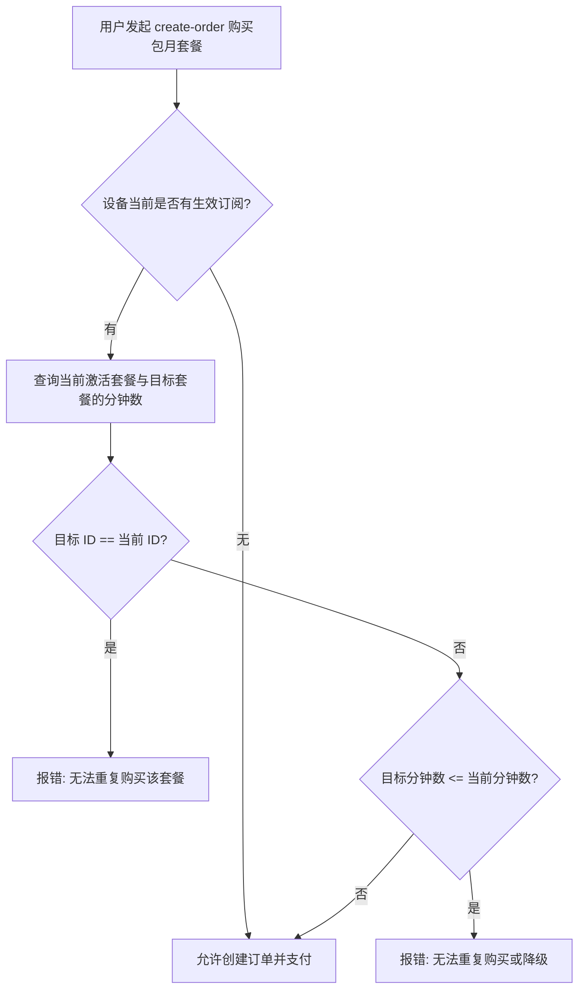

# 预防包月套餐降级与重复购买设计方案 (Design Specification)

> [!NOTE]
> 本文档定义了在初心语音充值体系中，如何对包月套餐（订阅套餐）实施安全的重复购买与降级购买拦截机制，同时保证弹性加油包不受限制。

## 1. 业务背景与问题定义

当前初心语音服务支持两种小程序套餐类型：
1. **包月订阅套餐 (Subscription Plans)**：带有特定月度分钟限额，有效期 30 天。当前版本仅支持向上升级，不支持同级重复购买或向低级降级（以避免覆盖/损失尚未用完的额度）。
2. **弹性加油包 (Fuel Packages)**：增加账户剩余通话分钟数，月底清零，不受任何持有状态限制。

### 存在的问题
在创建支付订单时，系统目前只拦截了“购买与当前激活的套餐完全相同 (ID一致) 的套餐”。
如果用户目前购买了 A 套餐，此后升级买了更高档的 B 套餐，此时用户的激活套餐变为 B 套餐。由于原先针对 A 的 ID 校验失效，用户可以重新创建 A 套餐的订单并支付，从而引发非预期的“高降低”套餐覆盖问题。

---

## 2. 解决方案设计 (方案 1: 基于额度分钟数拦截)

对 `create_payment_order` 接口进行增强：在处理**包月套餐**购买请求时，如果设备当前持有尚未过期的包月套餐，将目标套餐的 `duration_minutes` 与当前激活套餐的 `duration_minutes` 进行比较：
* 若 `目标分钟数 <= 当前分钟数` 且 `计划不同`：抛出降级拦截异常。
* 若 `目标 ID == 当前 ID`：抛出重复购买拦截异常。
* 弹性加油包（`duration_days == 0`）跳过此限制。

### 2.1 数据库字段与层级定义
对比使用 `miniapp_subscription_plans` 中的 `duration_minutes` 字段，该字段在数据表中为强正整数约束，能够稳定、直观地表征套餐的物理规格大小。

---

## 3. 核心变动与数据流向

### 3.1 核心数据流



### 3.2 代码修改点

* [postgres_repository.py](file:///home/peter/huada/project/Interesting/codex_agent/shuxin/src/shuxin/voice/postgres_repository.py#L817-L832)：更新 `create_payment_order` 方法中的校验段：
  ```python
  if duration_days > 0 and target_device_id:
      dev_quota = await conn.fetchrow(
          """
          SELECT subscription_plan_id, subscription_expires_at
          FROM devices
          WHERE device_id = $1
          """,
          target_device_id
      )
      if dev_quota:
          sub_plan_id = dev_quota["subscription_plan_id"]
          sub_expires_at = dev_quota["subscription_expires_at"]
          from datetime import datetime, timezone
          if sub_plan_id and sub_expires_at is not None and sub_expires_at > datetime.now(timezone.utc):
              if sub_plan_id == plan_id:
                  raise PermissionError("您已拥有该月度套餐，在有效期内无法重复购买。")
              
              # 查询当前套餐与目标套餐的额度分钟数进行比较
              curr_plan = await conn.fetchrow(
                  "SELECT duration_minutes FROM miniapp_subscription_plans WHERE plan_id = $1",
                  sub_plan_id
              )
              target_plan = await conn.fetchrow(
                  "SELECT duration_minutes FROM miniapp_subscription_plans WHERE plan_id = $1",
                  plan_id
              )
              if curr_plan and target_plan:
                  if target_plan["duration_minutes"] <= curr_plan["duration_minutes"]:
                      raise PermissionError("您已拥有更高级别或同级别的月度套餐，在有效期内无法降级购买。")
  ```

---

## 4. 测试与验证计划

1. **回归测试**：运行 `tests/test_miniapp_billing.py` 中的 `test_create_miniapp_payment_order_duplicate_purchase` 确保相同套餐重复购买仍会被拦截。
2. **新增集成测试**：在 `tests/test_miniapp_billing.py` 中新增 `test_create_miniapp_payment_order_downgrade_purchase`。
   * 模拟当前设备激活套餐为 `standard` (300分钟)。
   * 尝试创建 `basic` (120分钟) 套餐订单。
   * 断言其抛出 `PermissionError`，且包含降级拦截提示语。
