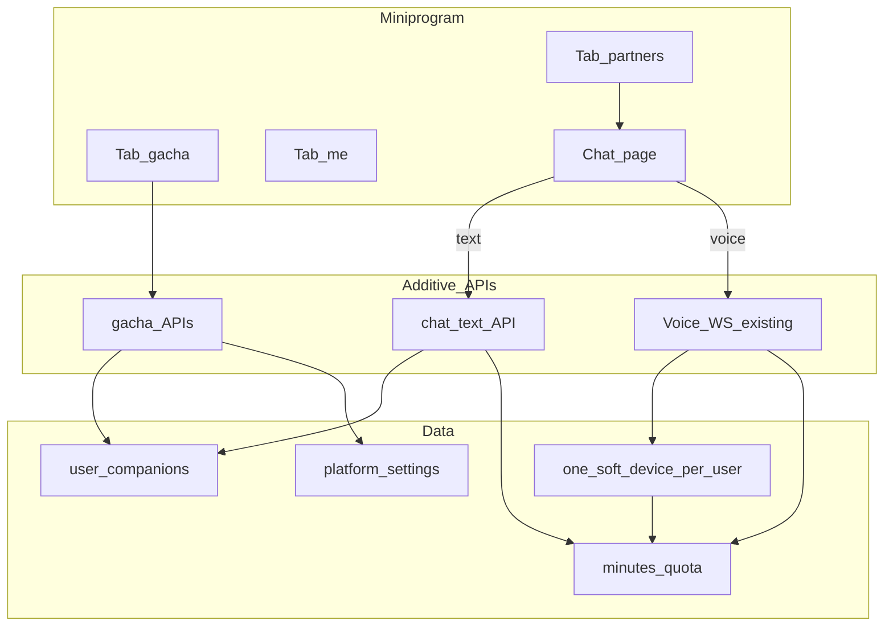

# Design: Investor Miniprogram — Gacha Companions + Text/Voice Chat

**Date:** 2026-07-22  
**Branch (planned):** `feat/investor-miniprogram-gacha-chat`  
**Status:** Draft for human review (not implemented)

## 1. Objective

Prove to investors that 舒心 has **software distribution and willingness to pay**, while hardware is unstable.

- Users draw MBTI companions via a slot-machine UX in the WeChat miniprogram.
- Free: **3 draw attempts** per account (each draw consumes one, including duplicate MBTI).
- After free draws: **pay-then-draw** (default **¥9.9**, admin-configurable).
- Multiple companions of the **same MBTI** are allowed (separate rename + chat).
- Chat supports **text and voice**.
- This line is **temporary**; hardware-bound product remains the long-term path. Schema and modules must be disposable without polluting production device semantics.

### Success criteria (investor demo)

- New user can draw ≥1 companion without hardware.
- Slot animation reveals four MBTI letters; result matches server.
- User can chat by text and by voice with a drawn companion.
- Paid draw charges WeChat Pay then grants a companion.
- Admin can change draw price and per-type weights.
- Text billing is isolated and swappable later.

## 2. Non-goals

- Replacing hardware bind / sealed MBTI factory flow.
- Rewriting Voice WebSocket STT→LLM→TTS core loop.
- Building a second wallet unrelated to subscription minutes.
- Keeping mall as a primary Tab in this demo (mall moves under 我的 or is hidden).

## 3. Product decisions (locked)

| Topic | Decision |
|-------|----------|
| Companion identity | Pure software; no hardware required |
| Free quota | 3 **draw attempts** lifetime; duplicates consume |
| Paid flow | Pay first, then draw, then insert companion |
| Duplicate MBTI | Allowed as separate companions |
| Probability | Admin weights; some rare, rest equal (or explicit) |
| Paid price default | ¥9.9 |
| IA Tabs | **伙伴 \| 抽卡 \| 我的** |
| Visual | Quiet list (Apple-like) + flashy gacha |
| Voice | Reuse existing Voice WebSocket |
| Text | New thin HTTP API; LLM cost only |
| Text input cap | 500 chars (admin-configurable) |
| Text→minutes | Configurable module; formula may change later |
| Schema | Separate `user_companions` table (demo-disposable) |
| Soft device | **One shadow soft device per user** for quota + WS auth |

## 4. Architecture (minimum change, clean seams)

```text
Miniprogram
  伙伴 → list companions → chat
  抽卡 → slot UI → gacha APIs + WeChat Pay
  我的 → subscription top-up, hardware bind (secondary), settings

Backend (additive)
  user_companions          — source of truth for App companions
  users.metadata           — free_gacha_remaining
  platform_settings        — gacha price/weights + text_billing config
  One soft device / user   — minutes pool + WS credential only
  POST /api/gacha/*        — config, orders, draw
  POST /api/chat/text      — LLM-only turn + swappable billing helper
  Voice WS                 — soft device auth + companion_id for persona/memory

Unchanged
  Hardware bind / sealed→locked MBTI
  Voice turn pipeline & deduct order (subscription → fuel → daily)
  Existing subscription / fuel payment products
```



## 5. Data model

### 5.1 `user_companions` (new)

| Column | Notes |
|--------|-------|
| `id` | UUID / bigserial PK |
| `user_id` | FK users |
| `mbti` | e.g. INTJ |
| `display_name` | default from `mbti_profiles.yaml` |
| `source` | `free_gacha` \| `paid_gacha` |
| `payment_id` | nullable; paid draws |
| `created_at` | timestamptz |

Indexes: `(user_id, created_at DESC)`.

### 5.2 Soft device (reuse `devices`, constrained)

- Exactly **one** per user with `metadata.kind = "soft"` (or equivalent flag).
- Purpose: WS authentication + minutes quota attachment.
- **Not** the product entity for “partner”; do not list soft devices as hardware in 我的→设备 unless filtered out.
- Created lazily on first companion or first chat needing voice.

### 5.3 User gacha state

- `users.metadata.free_gacha_remaining` default `3`.
- Optional `gacha_history` for audit (append-only log table preferred if history grows).

### 5.4 `platform_settings` keys

**Gacha**

```json
{
  "paid_draw_price_yuan": 9.9,
  "free_draws_per_user": 3,
  "weights": {
    "INTJ": 5,
    "INFJ": 5,
    "ENFP": 10
  }
}
```

Unlisted types share remaining weight equally (implementation detail to document in code).

**Text billing (swappable)**

```json
{
  "text_max_chars": 500,
  "llm_input_yuan_per_m_tokens": 0.85,
  "llm_output_yuan_per_m_tokens": 1.7,
  "llm_cache_yuan_per_m_tokens": 0.02,
  "yuan_to_minutes_rate": 1.0
}
```

Voice reference costs (for docs / future; voice formula stays as today unless separately changed):

- TTS: 20k chars / ¥28  
- STT: 60 hours / ¥40  
- LLM: same token rates as above  

**Isolation rule:** All text cost math lives in one module e.g. `voice/billing/text_billing.py` (name flexible). Chat route only calls `estimate_minutes(...)` / `actual_minutes_from_usage(...)`. Changing the formula later must not require rewriting Agent or WS.

## 6. Gacha flow

### UX

1. Show remaining free draws.
2. Free → tap draw; Paid → WeChat Pay → draw.
3. Client plays four-reel slot animation; **final letters = server `mbti`**.
4. Create companion → navigate to card / chat.

### APIs

| Method | Path | Behavior |
|--------|------|----------|
| GET | `/api/gacha/config` | price, free remaining, weights optional |
| POST | `/api/gacha/orders` | create WeChat prepay for `gacha_draw` |
| POST | `/api/gacha/draw` | `{ payment_id?: string }` — free or paid; weighted sample; insert companion; decrement free or consume payment |
| GET | `/api/companions` | list companions for user |
| PATCH | `/api/companions/{id}` | rename |

Admin: edit gacha settings (miniapp-admin or `/admin` — reuse existing settings patterns).

### Rules

- Same `payment_id` redeemable once.
- Draw result never trusted from client.
- Duplicate MBTI always allowed.

## 7. Chat + billing

### Voice

- Connect existing Voice WS using the user’s soft device credentials.
- Pass `companion_id` so runtime applies that companion’s MBTI / memory home.
- Billing: existing STT + TTS + LLM minutes path; **do not change deduct order**.

### Text

1. Auth session user; verify companion ownership.
2. Reject if `len(text) > text_max_chars`.
3. `estimate_minutes` gate against user quota pool (via soft device aggregation).
4. Run Agent (same companion persona).
5. Read LLM `usage` (prompt / completion / cache if present).
6. `actual_minutes_from_usage` → `deduct_*_minutes` (same pools).
7. Persist short-term memory under companion scope.

DMX per-user key balance APIs ([token search](https://doc.dmxapi.cn/key-yuer.html)) expose **aggregate yuan only**, not per-call model/in/out/cache. **Do not** use DMX polling for per-turn text billing; use response `usage`. DMX remains for ops/top-up.

## 8. UI design notes

- **伙伴:** light gray canvas, large title, row list (avatar tint + name + MBTI), empty CTA → 抽卡.
- **抽卡:** slot machine hero; primary CTA; result sheet.
- **聊天:** bubbles; text field + hold-to-talk; quota nudge.
- **我的:** subscription, hardware bind secondary, legal.

Motion budget: gacha reels + stop + reveal only.

## 9. Git / delivery

1. Create branch `feat/investor-miniprogram-gacha-chat` from agreed base.
2. Implement behind clear module boundaries (`companions`, `gacha`, `text_billing`).
3. Miniprogram: rebuild with `scripts/wechat_miniprogram_dev.sh build`.
4. Demo script for investors (draw → chat text → chat voice → paid draw).

## 10. Boundaries

- **Always:** Server-authoritative gacha; isolate text billing; filter soft devices out of hardware UX; run focused tests for gacha + text billing.
- **Ask first:** Changing voice minute formula; deleting soft-device approach; bringing mall Tab back as primary.
- **Never:** Commit secrets; mix companion rows into hardware-only assumptions; trust client for MBTI outcome.

## 11. Open follow-ups (post-demo)

- Whether soft device can be removed if WS gains user-session + companion_id auth without device secret.
- Final text→minutes rate calibration vs subscription SKUs.
- Retire `user_companions` when hardware-only product returns.

## 12. Spec self-review

- [x] No TBD placeholders for locked decisions  
- [x] Companions table vs soft device roles consistent  
- [x] Text billing marked swappable  
- [x] Scope limited to investor miniprogram line  
- [x] Duplicate / free / paid rules unambiguous  
