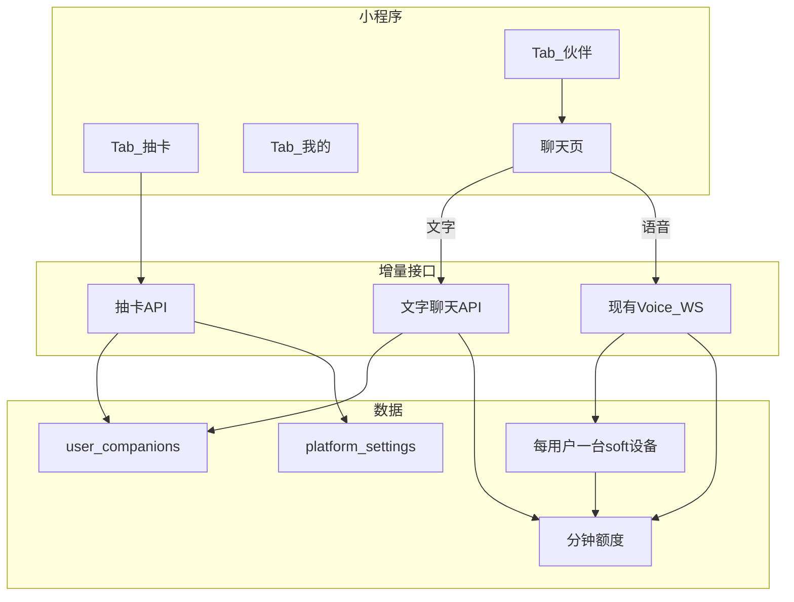

# 设计文档：投资人版小程序 — 抽卡伙伴 + 文字/语音对话

**日期：** 2026-07-22  
**计划分支：** `feat/investor-miniprogram-gacha-chat`  
**状态：** 供人工审阅的草稿（尚未实现）

## 1. 目标

在硬件尚不稳定时，用小程序向投资人证明舒心具备**软件分发能力与付费意愿**。

- 用户在小程序内通过**老虎机**抽取 MBTI 伙伴。
- 免费：每账号终身 **3 次抽卡机会**（每次抽取都消耗，含抽到相同 MBTI）。
- 免费用尽后：**先付费再抽**（默认 **¥9.9**，后台可改）。
- 允许同一用户拥有**多个相同 MBTI** 伙伴（可分别改名、分别聊天）。
- 对话支持**文字 + 语音**。
- 本条产品线为**临时投资人 demo**；长期仍以硬件绑定为主。表结构与模块须可整体废弃，且不污染量产「真设备」语义。

### 成功标准（投资人演示）

- 新用户无需硬件即可抽出 ≥1 个伙伴。
- 老虎机动画展示四个 MBTI 字母，结果与服务端一致。
- 用户可对已抽伙伴进行文字与语音对话。
- 付费抽卡走微信支付，成功后入库伙伴。
- 后台可改抽卡价格与各类型权重。
- 文字计费逻辑独立封装，后续可替换公式。

## 2. 非目标

- 替换硬件绑定 / 出厂 sealed MBTI 流程。
- 重写 Voice WebSocket 的 STT→LLM→TTS 主循环。
- 另建与订阅分钟池无关的第二套钱包。
- 本 demo 将「商城」保留为一级 Tab（商城降为「我的」次级或暂隐）。

## 3. 已锁定的产品决策

| 主题 | 决策 |
|------|------|
| 伙伴形态 | 纯软件，不依赖硬件 |
| 免费额度 | 终身 3 **次抽卡机会**；重复类型也扣次数 |
| 付费流程 | 先支付，再抽卡，再入库 |
| 相同 MBTI | 允许作为独立伙伴共存 |
| 概率 | 后台权重；部分稀有，其余均分（或全部显式配置） |
| 付费默认价 | ¥9.9 |
| Tab 信息架构 | **伙伴 \| 抽卡 \| 我的** |
| 视觉 | 列表克制（偏苹果）+ 抽卡页可炫 |
| 语音 | 复用现有 Voice WebSocket |
| 文字 | 新增薄 HTTP 接口；只计 LLM 成本 |
| 文字输入上限 | 500 字（后台可配） |
| 文字→分钟 | 可配置模块；公式允许后续修改 |
| 数据表 | 独立 `user_companions`（demo 可弃） |
| 影子设备 | **每用户仅 1 台** soft device，只挂额度 + WS 鉴权 |

## 4. 架构（最小改动 + 清晰边界）

```text
小程序
  伙伴 → 伙伴列表 → 聊天
  抽卡 → 老虎机 UI → 抽卡 API + 微信支付
  我的 → 订阅充值、硬件扫码（次要）、设置

后端（增量）
  user_companions          — App 伙伴唯一真相源
  users.metadata           — free_gacha_remaining
  platform_settings        — 抽卡价格/权重 + 文字计费配置
  每用户 1 台 soft device  — 分钟池 + WS 凭证
  POST /api/gacha/*        — 配置、下单、抽卡
  POST /api/chat/text      — 仅 LLM 回合 + 可替换计费助手
  Voice WS                 — soft 鉴权 + companion_id 切人格/记忆

不动
  硬件 bind / sealed→locked MBTI
  语音回合流水线与扣减顺序（订阅→加油包→日额度）
  现有订阅 / 加油包支付商品
```



## 5. 数据模型

### 5.1 `user_companions`（新建）

| 字段 | 说明 |
|------|------|
| `id` | 主键（UUID / bigserial） |
| `user_id` | 关联 users |
| `mbti` | 如 INTJ |
| `display_name` | 默认来自 `mbti_profiles.yaml`，可改名 |
| `source` | `free_gacha` \| `paid_gacha` |
| `payment_id` | 可空；付费抽关联支付单 |
| `created_at` | 时间戳 |

索引：`(user_id, created_at DESC)`。

### 5.2 影子 soft device（复用 `devices`，严格约束）

- 每用户**恰好一台**，`metadata.kind = "soft"`（或等价标记）。
- 用途：WS 鉴权 + 分钟额度挂载。
- **不是**「伙伴」业务实体；「我的→设备」列表须过滤掉 soft。
- 可在首次抽到伙伴或首次需要语音时懒创建。

### 5.3 用户抽卡状态

- `users.metadata.free_gacha_remaining`，默认 `3`。
- 历史记录可选：独立审计表（量变大时优于塞进 metadata）。

### 5.4 `platform_settings` 配置键

**抽卡**

```json
{
  "paid_draw_price_yuan": 9.9,
  "free_draws_per_user": 3,
  "weights": {
    "INTJ": 5,
    "INFJ": 5,
    "ENFP": 10
  }
}
```

未列出的类型均分剩余权重（实现时在代码注释写清）。

**文字计费（必须可替换）**

```json
{
  "text_max_chars": 500,
  "llm_input_yuan_per_m_tokens": 0.85,
  "llm_output_yuan_per_m_tokens": 1.7,
  "llm_cache_yuan_per_m_tokens": 0.02,
  "yuan_to_minutes_rate": 1.0
}
```

语音成本参考（文档用；语音公式暂维持现网，除非另行改）：

- TTS：2 万字 / ¥28  
- STT：60 小时 / ¥40  
- LLM：同上 token 单价  

**隔离规则：** 文字成本计算集中在单一模块（例如 `voice/billing/text_billing.py`）。聊天路由只调用 `estimate_minutes(...)` / `actual_minutes_from_usage(...)`。以后改公式不得迫使重写 Agent 或 WS 主路径。

## 6. 抽卡流程

### 体验

1. 展示剩余免费次数。
2. 有免费次数 → 直接抽；否则 → 微信支付 → 再抽。
3. 客户端播放四轴老虎机动画；**最终四字母 = 服务端返回的 `mbti`**。
4. 创建伙伴 → 展示结果卡 / 进入聊天。

### API

| 方法 | 路径 | 行为 |
|------|------|------|
| GET | `/api/gacha/config` | 价格、剩余免费次数等 |
| POST | `/api/gacha/orders` | 创建微信支付预下单（商品 `gacha_draw`） |
| POST | `/api/gacha/draw` | `{ payment_id?: string }` — 免费或付费校验；加权抽样；插入伙伴；扣免费次数或核销支付 |
| GET | `/api/companions` | 当前用户伙伴列表 |
| PATCH | `/api/companions/{id}` | 改名 |

后台：沿用现有 admin / miniapp-admin 配置编辑模式，改抽卡 settings。

### 规则

- 同一 `payment_id` 只能核销一次。
- 抽卡结果绝不信任客户端。
- 相同 MBTI 始终允许入库为新伙伴。

## 7. 对话与计费

### 语音

- 使用用户影子 soft device 凭证连接现有 Voice WS。
- 传递 `companion_id`，运行时套用该伙伴的 MBTI / 记忆目录。
- 计费：现有 STT + TTS + LLM 分钟路径；**不改扣减顺序**。

### 文字

1. 校验登录；校验 companion 属于当前用户。
2. 超过 `text_max_chars` 拒绝。
3. `estimate_minutes` 对用户额度池做门控（经 soft device 聚合）。
4. 调用 Agent（该伙伴人格）。
5. 读取 LLM `usage`（prompt / completion / cache 若有）。
6. `actual_minutes_from_usage` → 现有 `deduct_*_minutes`。
7. 短期记忆写入该 companion 作用域。

说明：DMX 按 key 查余额（[令牌余额查询](https://doc.dmxapi.cn/key-yuer.html)）主要是**汇总已用/剩余额度（元）**，拿不到单次模型与 in/out/cache 明细。**文字按轮扣费不要轮询 DMX**，以本轮响应 `usage` 为准。DMX 仍用于开通/充值与运营巡检。

## 8. 界面说明

- **伙伴：** 浅灰背景、大标题、行列表（色块头像 + 昵称 + MBTI）；空态主按钮「去抽卡」。
- **抽卡：** 中央老虎机；主按钮「摇一把」/「¥9.9 再抽」；结果全屏伙伴卡。
- **聊天：** 气泡；输入框 + 按住说话；额度不足引导充值。
- **我的：** 订阅充值、硬件绑定（次要）、协议与反馈。

动效预算：抽卡滚轴、停格、揭晓；列表几乎无动效。

## 9. Git / 交付

1. 从约定基线创建分支 `feat/investor-miniprogram-gacha-chat`。
2. 按模块边界实现（`companions`、`gacha`、`text_billing`）。
3. 小程序改完后执行 `scripts/wechat_miniprogram_dev.sh build`。
4. 准备投资人演示脚本：抽卡 → 文字聊 → 语音聊 → 付费再抽。

## 10. 边界

- **必须做：** 服务端权威抽卡；文字计费隔离；硬件 UI 过滤 soft device；抽卡与文字计费有针对性测试。
- **先问再做：** 改语音分钟公式；取消影子 device 方案；把商城重新提升为一级 Tab。
- **禁止：** 提交密钥；把 companion 当成真硬件假设；信任客户端 MBTI 结果。

## 11. Demo 之后可跟进

- 若 WS 支持「用户会话 + companion_id」且无需 device secret，可评估去掉 soft device。
- 校准文字「元→分钟」与订阅商品的对应关系。
- 回归纯硬件产品时退役 `user_companions`。

## 12. 规格自检

- [x] 已锁定决策无占位 TBD  
- [x] companions 表与 soft device 职责一致  
- [x] 文字计费标明可替换  
- [x] 范围限定在投资人小程序线  
- [x] 重复类型 / 免费 / 付费规则无歧义  
