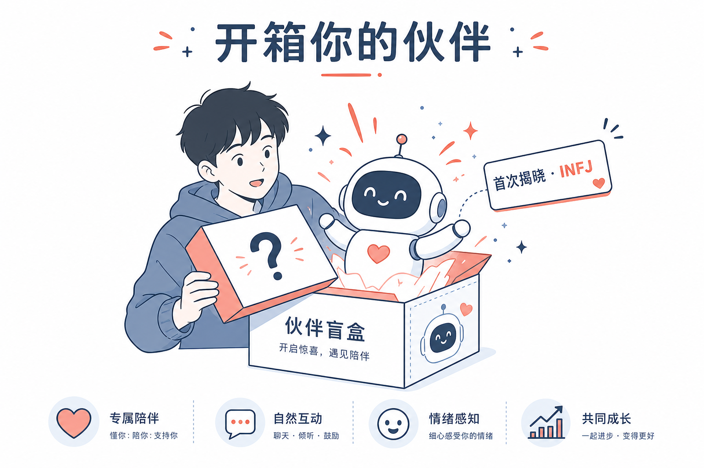
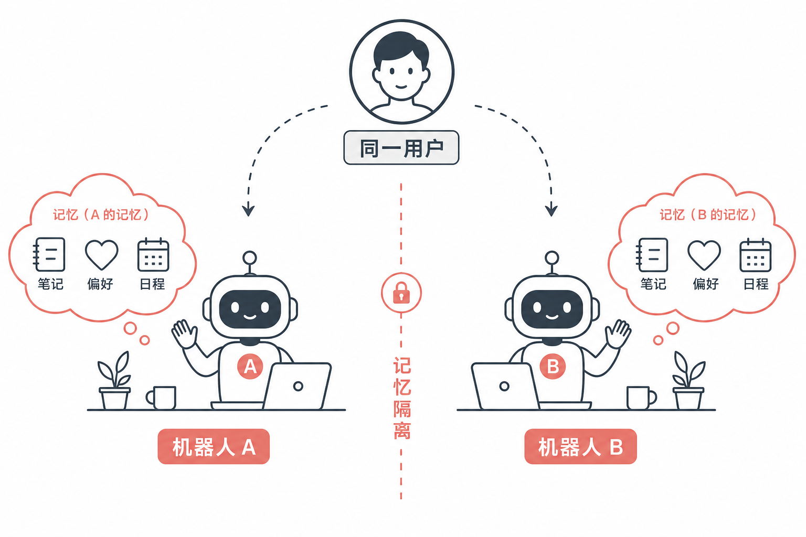

# 初心核心技术白皮书（投资人精简版）

> **首选外发稿**（约 1～2 分钟可读完）。叙事主轴：年轻人孤独 → 陪伴型机器人 → 盲盒人格与壁垒。  
> 长版扩写：[`CORE_TECH_INVESTOR_WHITEPAPER.md`](CORE_TECH_INVESTOR_WHITEPAPER.md) · 产品概念：[`MBTI_BLINDBOX_PRODUCT_CONCEPT.md`](MBTI_BLINDBOX_PRODUCT_CONCEPT.md) · 路演：[`../presentations/shuxin-core-tech/`](../presentations/shuxin-core-tech/) · 概念图：[`assets/core-tech/`](assets/core-tech/)

## 1. 为什么做 — 年轻人孤独与陪伴需求

越来越多年轻人在城市里「有连接、没陪伴」：社交很满，但真正被听见、被记得的时刻很少。他们要的往往不是一个更聪明的百科助手，而是一个**愿意长期在身边的伙伴**。**初心做的是陪伴型聊天机器人**—实体硬件、自然对话，把「陪伴」做成可交付的产品，而不是把大模型再包一层音箱皮肤。

---

## 2. 一段话：产品特点 × 技术壁垒

年轻人需要的是陪伴，不是更强的问答工具；初心因此把产品定义为**陪伴型语音聊天机器人**。每一台出厂就带一种盲盒 MBTI 气质，用户首次连接时开箱揭晓并锁定，从此「这一台是谁」清晰可感；同一账号可统一音色建立熟悉感，同时每台机器按自己的气质说话——同声、不同性格，多台就像多个伙伴而非备用机；每台还单独记住与主人的相处，记忆不串扰。支撑这一切的，是人格种子、开箱仪式、音色与气质分离、设备级记忆与云端陪伴 Agent「听—想—说」闭环；普通语音助手可以接入大模型，却很难复制「有性格、记得你、开箱即成立」的整套产品技术闭环。

---

## 3. 当前产品形态

可演示的形态：

- **品类**：桌面/便携向的语音陪伴机器人 + 微信小程序绑定与管理  
- **盲盒人格**：16 型 MBTI 作性格标签（非心理测评）；首次绑定开箱揭晓，之后锁定；对话里体现为用词、节奏、关心方式的可感知差异  

- **音色 × 气质分离**：账号侧统一音色；气质跟设备走，支持「同声不同性格」的多机叙事  
- **一机一记忆**：产品规则上每台独立相处记忆，多机不串、转赠不泄露前任对话  

- **语音闭环**：听 → 想 → 说；云端陪伴 Agent 承载固定灵魂、具有记忆功能

边界（避免误解）：不做用户自助重抽；不把 MBTI 包装成专业测评；开箱后类型不随聊天自动换型。

---

## 4. 为什么难复制

| 能力 | 为何构成壁垒 |
|------|----------------|
| **盲盒人格 + 开箱锁定** | 出厂预分配 → 首次揭晓 → 终身锁定；是可运营的产品机制，不是一句营销话术，申请专利中 |
| **音色 × 气质分离** | 多机收集逻辑成立：熟悉的声音 + 不同的性格 |
| **一机一记忆** | 「伙伴」落到数据边界，而不是换一层 UI 皮肤 |
| **内容与闭环** | 16 型需可感知的语气资产；人格·开箱·多机·记忆必须自洽运转 |
| **IP 布局** | 已围绕盲盒人格语音陪伴与开箱揭晓完成技术交底与实用新型材料准备 |

**一句话**：难的不是「会说话」，而是做出**陪得住、分得清、记得住**的那一台。
