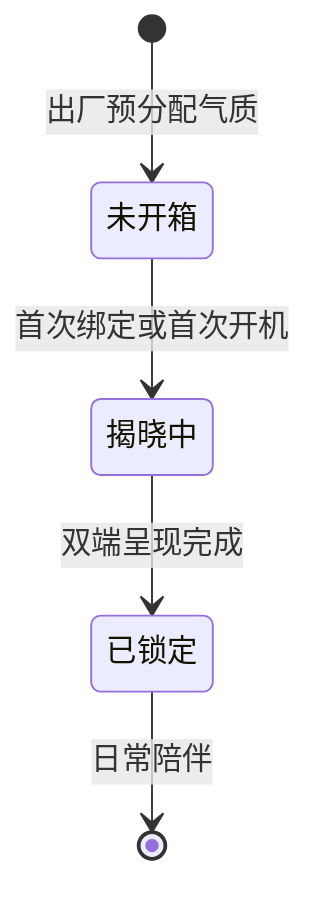
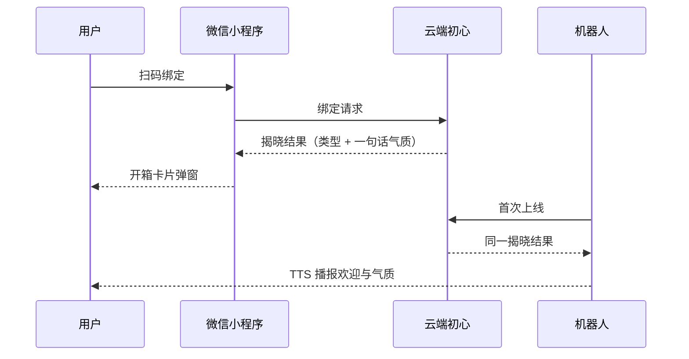
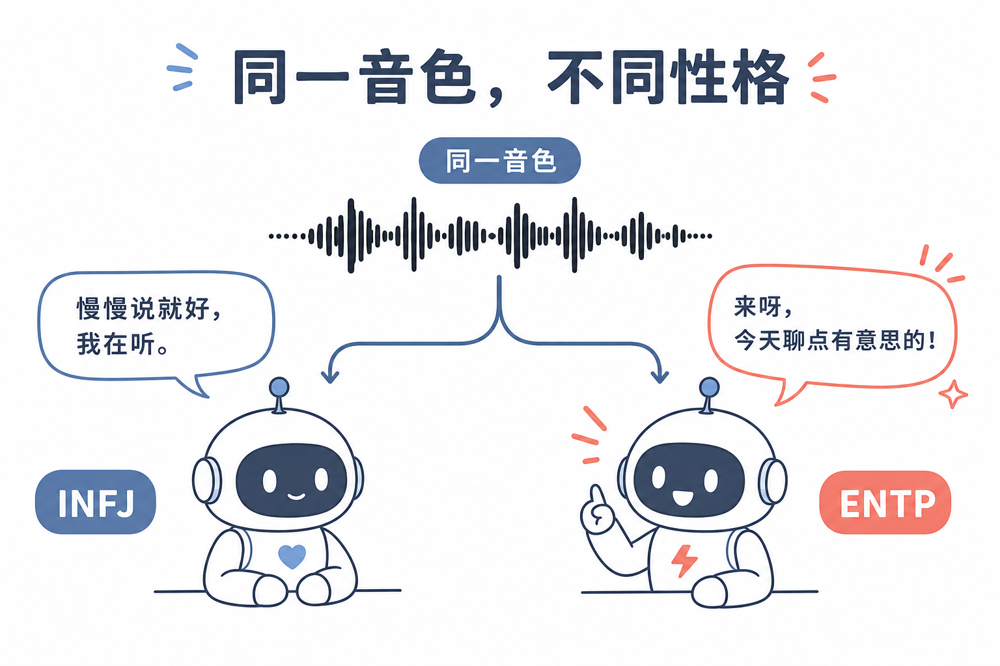
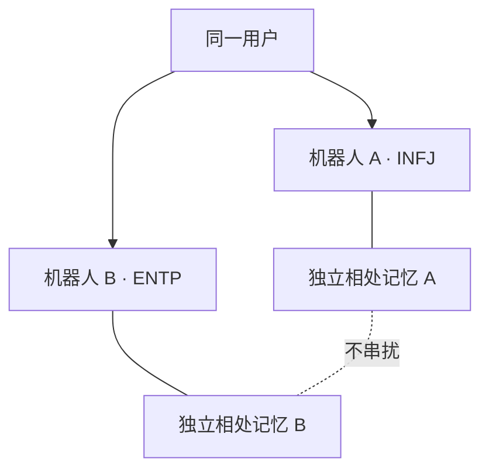
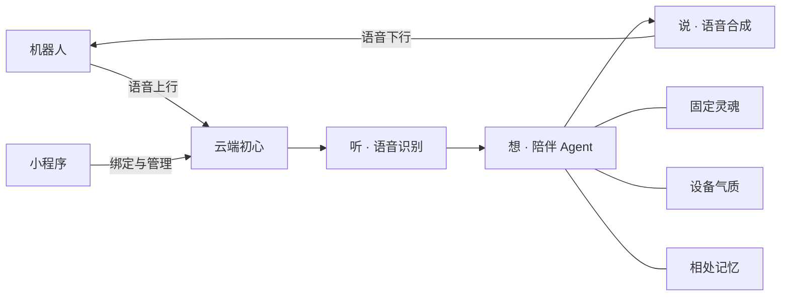
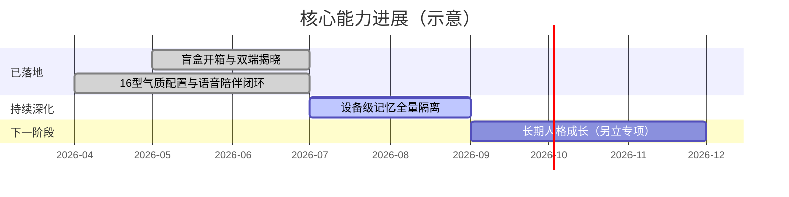

# 初心核心技术白皮书（投资人 / 商务版）

> **受众**：投资人、商务合作方  
> **版本**：v1.0 · 2026-07  
> **产品**：初心 — 语音陪伴型硬件机器人  
> **配套路演**：[`presentations/shuxin-core-tech/`](../presentations/shuxin-core-tech/)  
> **投资人精简版（首选外发）**：[`CORE_TECH_INVESTOR_BRIEF.md`](CORE_TECH_INVESTOR_BRIEF.md)

---

## 0. 一句话定位

> **初心不是「一台会说话的音箱」，而是「每台出厂就自带一种性格、开箱揭晓后终身陪伴」的语音伙伴。**  
> 核心技术：盲盒 MBTI 气质 × 音色气质分离 × 一机一记忆 × 云端陪伴 Agent 语音闭环。

| 维度 | 设计 |
|------|------|
| 一台机器人 | 出厂预置一种 MBTI 气质；首次连接「开箱」揭晓；之后锁定 |
| 一个用户多台 | 每台可不同性格，像养了多个伙伴 |
| 声音 | 账号侧统一音色（情感认同） |
| 说话方式 | 由**这台机器自己的 MBTI** 决定（同声、不同性格） |
| 记忆 | **每台机器人单独记住**与主人的相处 |

---

## 1. 我们在解决什么

消费级「语音助手硬件」往往高度同质：同样的唤醒词、同样的百科式回答、同样的「万能助手」人格。对用户而言：

1. **开箱无惊喜** — 买到的第 N 台和第一台体验几乎一样；
2. **缺少「伙伴感」** — 像工具，不像有性格的陪伴体；
3. **多机无意义** — 第二台、第三台只是备用机，而不是可收集、可对比的「不同性格的朋友」。

初心把差异化落在**设备级人格**：每台机器人在出厂时就带着一种气质种子；用户第一次连接时完成开箱仪式；之后长期相处都建立在「这一台是谁」之上。

---

## 2. 核心技术一：盲盒 MBTI 人格

### 2.1 产品定义

采用业界通用的 **16 型 MBTI** 作为**性格标签**（非心理测评工具）：

- 用户可理解的「这台机器人是谁」；
- 内容团队可围绕 16 型撰写差异化语气；
- 对话中体现为用词、节奏、关心方式、幽默程度等**可感知差异**。

**边界**：MBTI 是初始气质，开箱后**固定**；不是随聊天变型的测试，也不是用户可随时重抽的抽卡游戏。

### 2.2 盲盒生命周期（用户视角）

| 状态 | 用户感受 |
|------|----------|
| **未开箱** | 不知道这台是什么性格 |
| **揭晓中** | 看卡片 / 听播报：「你的伙伴是 INFJ · 提倡者」 |
| **已锁定** | 之后直接显示该类型，不再随机 |

### 2.3 双端一致开箱

开箱必须在**小程序**与**机器人**两侧呈现同一结果，避免「手机上写 INFJ、机器人却说 ENFP」。

### 2.4 多机收集感

同一用户购买多台时，每台可抽到不同 MBTI，形成轻量「集齐不同性格伙伴」的话题性——这是硬件产品相对纯 App 角色的天然优势。

---

## 3. 核心技术二：音色与气质分离

很多产品把「声音」和「性格」绑死：换角色 = 换音色。初心刻意拆开：

| 层 | 由谁决定 | 用户感知 |
|----|----------|----------|
| **音色** | 账号侧统一配置 | 「这是我熟悉的那个声音」 |
| **气质** | 每台设备自己的 MBTI | 「这台更安静 / 那台更跳脱」 |

结果是：**同声音、不同性格**——同一用户的两台机器可以说同一句话，但风格明显不同。

这让「收集多台」有意义：不是买两台同款助手，而是养两个性格不同、却用同一种声音陪你的伙伴。

---

## 4. 核心技术三：一机一记忆

陪伴产品的信任基础是「TA 记得我们」。若多台机器共享一份记忆，第二台会变成「复制人」，失去伙伴感；若转赠后仍泄露前任对话，则破坏隐私。

初心在产品规则上明确：

- **每台机器人独立记住**与当前主人的相处；
- 同一账号下多台机器**记忆互不串扰**；
- 设备转赠给新主人时，**不应**看到上一任的私密对话；
- 原主人若再次绑定同一台机器，应能找回**与这台机器**之前的相处。

记忆按设备隔离的产品规则已定义，并在语音陪伴路径中持续深化落地。

---

## 5. 语音陪伴闭环（一句话）

实体机器人通过云端完成「听 → 想 → 说」：

- **固定灵魂**：价值观与边界稳定，不因 MBTI 而 OOC；
- **设备气质**：这台盲盒开出的性格，影响表达方式；
- **相处记忆**：这台机器与主人的私有上下文。

用户感知到的不是「又一个大模型」，而是「这一台有性格、记得我的伙伴」。

---

## 6. 为什么难复制（护城河）

| 能力 | 为什么构成差异化 |
|------|------------------|
| **盲盒状态机** | 出厂预分配 → 首次揭晓 → 终身锁定；可运营、可售后，而非一次性营销话术 |
| **双端一致揭晓** | 手机仪式 + 设备播报同一结果，形成完整开箱体验 |
| **气质内容运营** | 16 型需可感知的语气差异，是持续内容资产，不是贴标签 |
| **音色 × 气质分离** | 支持「同声不同性格」的多机叙事，硬件收集逻辑成立 |
| **一机一记忆** | 把「伙伴」落到数据边界，而非仅 UI 皮肤 |
| **知识产权布局** | 已围绕「盲盒人格语音陪伴机器人及其开箱揭晓」完成技术交底与实用新型材料准备 |

普通语音助手可以接入大模型；难的是把**人格、开箱、多机、记忆**做成一套自洽的产品技术闭环。

---

## 7. 进展与边界

**已落地（可演示）**

- 盲盒开箱 UX（小程序卡片 + 设备欢迎播报）
- 16 型气质配置与对话表达差异
- 语音陪伴闭环（听 → 想 → 说）与设备绑定

**明确边界（本期不讲成卖点）**

- 用户自助重抽 MBTI
- 把 MBTI 包装成专业心理测评
- 开箱后性格随时间自动切换（长期「成长」另立项目）

---

## 附录 A · 已具备能力（不展开）

以下能力支撑产品可交付，但不构成本白皮书主叙事：

- [x] 微信小程序绑定与设备管理
- [x] 蓝牙配网（量产固件对接）
- [x] 出厂制码与工厂验收流程
- [x] 语音额度与计费
- [x] 高品质语音合成（音色复刻）
- [x] 位置 / 天气等生活能力（按需）
- [x] 真人通话信令（媒体不经云端转发）

---

## 附录 B · 材料索引

| 材料 | 用途 |
|------|------|
| 本文 | 投资人 / 商务核心技术叙事 |
| [`MBTI_BLINDBOX_PRODUCT_CONCEPT.md`](MBTI_BLINDBOX_PRODUCT_CONCEPT.md) | 盲盒产品对外评审版（体验细节） |
| [`presentations/shuxin-core-tech/`](../presentations/shuxin-core-tech/) | Slidev 路演 + 页码大纲 |
| IDE Canvas：`shuxin-core-tech-overview` | 四象限一页纵览（Cursor 内打开） |

---

## 修订记录

| 版本 | 日期 | 说明 |
|------|------|------|
| v1.0 | 2026-07-17 | 首版：窄版四支柱 + Mermaid + 概念图；配套路演 |
