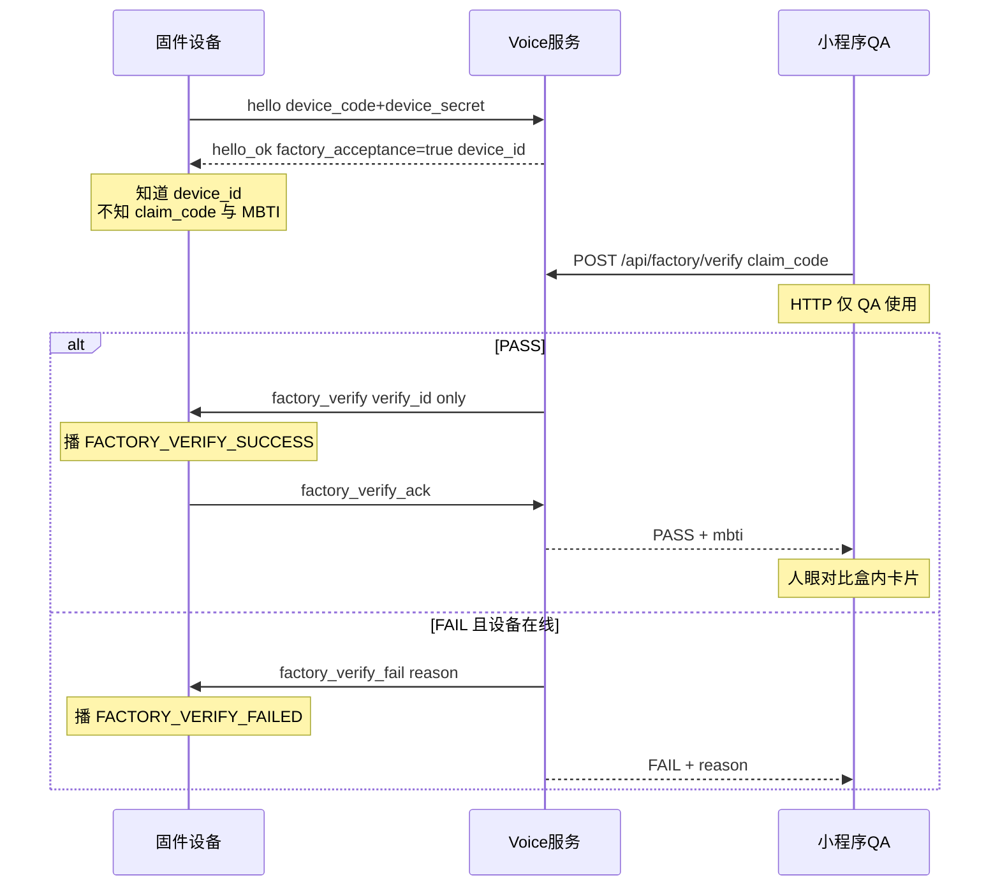
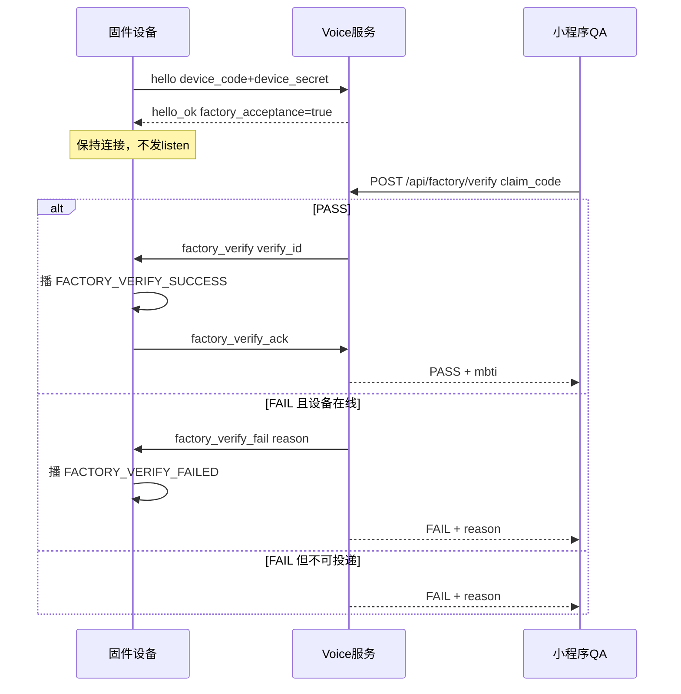

# 出厂工厂验收 — 硬件对接交接

> **读者**：固件工程师、工厂 QA、硬件项目经理。  
> **状态**：全栈已落地（2026-06-15）：未绑定设备 `factory_acceptance` hello、小程序 QA 入口、Admin 权限；固件按 §3 实现即可对接。  
> **协议详表**：[`VOICE_HARDWARE_WS_PROTOCOL.md`](VOICE_HARDWARE_WS_PROTOCOL.md)  
> **内部 QA SOP**：[`VOICE_DEMO_MIN_TEST.md`](VOICE_DEMO_MIN_TEST.md) §9.2.2

## 1. 功能说明

出厂 QA 扫描外壳 `claim_code`，云端验证「外壳码 ↔ 设备身份 ↔ 设备密钥」三码一致；PASS 时展示云端 MBTI，供 QA 与盒内人格卡片肉眼核对。

**与小程序用户绑定的区别**：

| 项 | 出厂验收 | 用户绑定后 |
|----|----------|------------|
| 设备状态 | `provisioned`，无 active binding | `bound` + active binding |
| hello 响应 | `factory_acceptance: true` | 标准 `hello ok` |
| MBTI | 保持 `mbti_status=sealed`，不揭晓 | bind / hello 可揭晓 → `locked` |
| 对话 | 禁止 `listen` / 音频帧 | 正常 STT/LLM/TTS |
| 固件动作 | 收 `factory_verify` 播成功 → 回 ack；收 `factory_verify_fail` 播失败 | 正常语音对话 |

### 1.1 信息认知边界（固件收什么 / 不收什么）

出厂验收时，**HTTP 仅 QA 小程序使用**；固件只走 WebSocket。下列表说明各方各自知道什么：

| 数据 | 固件 | QA 小程序 | 盒内卡片 | 验收后 DB |
|------|------|-----------|----------|-----------|
| `device_id` | 烧录 + hello 回显 | PASS 响应 | 无 | 有 |
| `claim_code` | **不知** | 扫码输入 | 无（在外壳） | 有 |
| MBTI | **不知**（sealed） | PASS 时显示 | 印刷 | sealed |
| `factory_verify` | **收**（成功触发） | 不直接收 | 无 | 日志 |
| `factory_verify_fail` | **收**（在线失败触发） | 不直接收 | 无 | 日志 |

**固件会收到**：

- `hello ok`：`device_id`、`factory_acceptance: true`（**无 MBTI**）
- `factory_verify`：仅 `verify_id` + `timestamp`（**无 device_id、无 MBTI、无 PASS**）
- `factory_verify_fail`：`verify_id` + `reason`（**无 claim_code、无 MBTI**）

**固件不会收到**：`claim_code`、MBTI 性格。性格核对是 QA 人眼（手机 vs 卡片）；用户绑定后才揭晓 MBTI。`claim_code_not_found` 与 `device_offline` 无法投递到硬件，`ack_timeout` 不再补发失败通知，避免设备已播成功后又播失败。

局域网 host 获取与 QA 双路径联调见 [VOICE_HARDWARE_HANDBOOK.md §2.10](VOICE_HARDWARE_HANDBOOK.md)。



## 2. 烧录与制码数据

Admin 批量制码每条 `items[]` 含：

| 字段 | 烧录/印刷 | 用途 |
|------|-----------|------|
| `device_id` / `device_code` | 烧录进固件 | WebSocket `hello` |
| `device_secret` | 烧录进固件 | WebSocket `hello` 鉴权 |
| `claim_code` | 贴外壳条码/二维码 | 仅 QA 扫码，**不进固件** |
| `mbti` | 印盒内人格卡片 | QA 与 PASS 响应比对 |

**红线**：`device_secret` 不得贴在外壳；出厂阶段**不要**走小程序绑定。

## 3. 固件最小实现（5 步）

### 3.1 连接

```text
ws://<host>:8765/ws/voice
```

### 3.2 发送 hello

```json
{
  "type": "hello",
  "device_code": "SX-000116",
  "device_secret": "<烧录密钥>",
  "client_id": "device-001",
  "audio_params": {
    "format": "opus",
    "sample_rate": 16000,
    "channels": 1,
    "frame_duration": 60
  }
}
```

### 3.3 收到 hello ok 且 `factory_acceptance: true`

```json
{
  "type": "hello",
  "state": "ok",
  "user_id": "factory_probe",
  "device_id": "SX-000116",
  "client_id": "device-001",
  "session_id": "...",
  "factory_acceptance": true
}
```

固件动作：

- 进入出厂验收模式
- **保持 WebSocket 连接**（断开会导致 QA 报 `device_offline`）
- **不要**发 `listen`、音频二进制帧（云端返回 `factory acceptance mode: conversation disabled`）
- **不要**期待 MBTI 揭晓 TTS

### 3.4 监听 `factory_verify`

**`factory_verify` 不含 MBTI**；性格仅在 QA 小程序的 HTTP PASS 响应中展示，供与盒内卡片核对。固件侧只需把此消息当作「验收通过」触发。

QA 扫外壳码后云端下发（任意固件状态均可处理）：

```json
{
  "type": "factory_verify",
  "verify_id": "550e8400-e29b-41d4-a716-446655440000",
  "timestamp": "2026-06-15T05:37:00Z"
}
```

固件动作：播放 `FACTORY_VERIFY_SUCCESS`（或同等 UI / 蜂鸣器 / LED **PASS** 提示）。

### 3.4.1 监听 `factory_verify_fail`

设备在线且云端判定验收失败时，云端下发失败通知：

```json
{
  "type": "factory_verify_fail",
  "verify_id": "550e8400-e29b-41d4-a716-446655440000",
  "reason": "verify_in_progress"
}
```

固件动作：播放 `FACTORY_VERIFY_FAILED`（或同等 UI / 蜂鸣器 / LED **FAIL** 提示），无需回包。

失败通知边界：

| 场景 | 硬件提示 | 说明 |
|------|----------|------|
| 收到 `factory_verify` | `FACTORY_VERIFY_SUCCESS` | 验收通过 |
| 收到 `factory_verify_fail` | `FACTORY_VERIFY_FAILED` | 云端可定位在线设备的失败 |
| hello/鉴权失败 | `FACTORY_VERIFY_FAILED` | 本地失败，云端无法发验收消息 |
| 验收中 WS 断线 | `FACTORY_VERIFY_FAILED` | 保持连接是验收前提 |
| ack 发送失败 | `FACTORY_VERIFY_FAILED` | 本地重试耗尽后 |
| QA `ack_timeout` | 不播失败音 | 设备可能已播成功，以小程序结果为准 |

### 3.5 10 秒内回 `factory_verify_ack`

```json
{
  "type": "factory_verify_ack",
  "verify_id": "<原样复制>",
  "status": "ok"
}
```

`verify_id` 原样回传即可，无需解析含义。超时后云端对 QA 报 FAIL（`ack_timeout`）。

## 4. 出厂模式允许的消息

| 方向 | 类型 | 说明 |
|------|------|------|
| 上行 | `hello` | 首次鉴权 |
| 上行 | `factory_verify_ack` | 验收回包 |
| 上行 | `ping` | 保活 → 下行 `pong` |
| 上行 | `abort` | 清状态 |
| 下行 | `factory_verify` | QA 扫码触发 |
| 下行 | `factory_verify_fail` | 云端验收失败且设备在线 |
| 下行 | `error` | 如误发 `listen` |

## 5. 端到端时序



## 6. 常见错误

| 现象 | 原因 | 处理 |
|------|------|------|
| `device is not bound or disabled` | 设备已绑定，或非 `provisioned` | 用新制码未绑定设备 |
| hello 无 `factory_acceptance` | 走了正常绑定 hello | 确认无 active binding |
| QA 报 `device_offline` | WS 未连接或已断开 | 保持 hello 后连接 |
| QA 报 `ack_timeout` | 10s 内未回 ack | 实现 `factory_verify_ack` |
| `listen` 返回 error | 出厂模式禁止对话 | 预期行为，勿发 listen |

## 7. 无真机联调（云端自测）

**QA 账号**：Admin `/admin` → 用户 Tab → 勾选该用户的 **工厂 QA**，小程序个人中心会出现「工厂验收」入口。

1. Admin 批量制码 → **不绑定**
2. 打开 `http://<host>:8765/voice-demo`，手动填入 `device_code` + `device_secret` 后连接
3. 日志见 `factory_acceptance: true`（voice-demo 已自动回 `factory_verify_ack`）
4. 小程序 **个人中心 → 工厂验收** 扫 `claim_code` → PASS + MBTI

自动化：`PYTHONPATH=src pytest tests/test_factory_verify.py tests/test_users_me_api.py -q`

## 8. 验收后状态（DB）

出厂验收成功后：

- `devices.metadata.mbti_status` 仍为 `sealed`
- 无 `device_bindings` 记录
- `factory_verify_logs` 有 PASS 记录（含 `mbti`）；日志默认保留 **15 天**（`SHUXIN_FACTORY_VERIFY_LOG_RETENTION_DAYS`，`0` = 不删），小程序与 Admin 查询均受此限制；voice server 周期任务硬删超期行。

用户扫码绑定后，才进入正常对话与 MBTI 揭晓流程。

## 9. 全栈能力清单（2026-06-15 已完成）

| 模块 | 能力 |
|------|------|
| 云端 WebSocket | `provisioned` 且无 active binding → `authenticate_device_for_factory()`；`hello_ok.factory_acceptance=true`；拦截 `listen` / `text_turn` |
| 验收 API | QA 扫 `claim_code` → `POST /api/factory/verify` → WS 下发 `factory_verify` → 等 `factory_verify_ack`（10s）→ PASS + MBTI 卡片 |
| 用户资料 API | `POST /api/users/me` 返回 `user_id`、`roles.factory_qa`、嵌套 `quota` |
| Admin | 用户 Tab：**工厂 QA**（`metadata.factory_role`，勾选即 PATCH）；**启用**（`users.enabled`，改值后点「保存」） |
| 小程序 | 个人中心：完整 `user_id` + 复制；`factory_qa` 时显示「工厂验收」；`verify.vue` 深链权限守卫 |
| 自动化测试 | `tests/test_factory_verify.py` + `tests/test_users_me_api.py`（14 用例） |

**数据落库**（验收成功后）：`factory_verify_logs` 有 PASS 记录（含 `mbti`）；`devices.metadata.mbti_status` 仍为 `sealed`；无 `device_bindings`。

**上线 / 联调三步**：

```bash
bash scripts/redeploy_docker.sh
bash scripts/wechat_miniprogram_dev.sh build   # 改小程序后必做
PYTHONPATH=src pytest tests/test_factory_verify.py tests/test_users_me_api.py -q
```

## 10. QA 权限、Admin 与小程序

### 10.1 Admin 两列不要混用

| Admin 列 | 数据库 | 作用 | 保存方式 |
|----------|--------|------|----------|
| **工厂 QA** | `users.metadata.factory_role = "true"` | 仅控制小程序「工厂验收」入口与 `POST /api/factory/verify` | 勾选后**立即** PATCH |
| **启用** | `users.enabled` | 账号总开关；`false` 时拒 `/api/users/me`、绑定、验收等 | 改输入框后点该行 **「保存」** |

### 10.2 小程序入口逻辑

1. 个人中心 `onShow` 调用 `POST /api/users/me`（`session_token`）。
2. 响应 `roles.factory_qa === true` 时渲染「工厂验收」按钮。
3. 个人中心同时展示**完整** `user_id` 与「复制」，用于与 Admin 用户行核对。

### 10.3 排障清单

| 现象 | 原因 | 处理 |
|------|------|------|
| 个人中心 `user_id` 被截断（`wx_xxx...`）或无「工厂验收」按钮 | 微信开发者工具仍是**旧编译包** | `bash scripts/wechat_miniprogram_dev.sh build`，开发者工具重新编译并刷新 |
| Admin 已勾 QA，小程序仍无入口 | QA 开在了**另一个** `user_id` | 个人中心「复制」完整 ID，与 Admin 勾选行对比 |
| 个人中心报错 `user is disabled or not found` | `users.enabled = false` | Admin 将该用户「启用」设为 `true` 并点「保存」 |
| `/api/users/me` 返回 404 | 后端未部署含该路由的版本 | `bash scripts/redeploy_docker.sh` |

更细的内部 QA SOP 见 [`VOICE_DEMO_MIN_TEST.md`](VOICE_DEMO_MIN_TEST.md) §9.2.2。

## 11. 固件阅读指引（硬件同事）

> **给固件工程师的快速入口**：本节汇总「小程序验证流程」与必读文档顺序。HTTP 扫码由 QA 小程序完成，**固件只需实现 WebSocket 侧逻辑**，不必阅读小程序源码。

### 11.1 一句话流程

Admin 给用户勾选 **工厂 QA**（`factory_role`）→ QA 在小程序扫外壳 `claim_code`（**HTTP** `POST /api/factory/verify`）→ 云端校验三码（`claim_code` ↔ `device_id` ↔ `device_secret`）→ **成功/失败分别通知固件（WS）与小程序（HTTP）**。

固件**不知道** `claim_code` 与 MBTI；性格核对由 QA 人眼对比（手机 PASS 响应 vs 盒内人格卡片）。

### 11.2 必读文件（按顺序）

| 顺序 | 文件 | 阅读重点 |
|------|------|----------|
| 1 | 本文档 §1–§6 | 认知边界、固件 5 步实现、时序图、常见错误 |
| 2 | [`VOICE_HARDWARE_WS_PROTOCOL.md`](VOICE_HARDWARE_WS_PROTOCOL.md) | `factory_acceptance` hello、`factory_verify` / `factory_verify_fail` / `factory_verify_ack` JSON 字段 |
| 3 | [`VOICE_HARDWARE_QUICKSTART.md`](VOICE_HARDWARE_QUICKSTART.md) §2.1 | 出厂验收前置条件速查 |
| 4 | [`data/device_assets/zh-CN/manifest.json`](../data/device_assets/zh-CN/manifest.json) + `FACTORY_VERIFY_*.opus.bin` | 验证成功/失败 Flash 提示音烧录（16 kHz / 16 kbps） |

可选深入：[`VOICE_HARDWARE_INTEGRATION.md`](VOICE_HARDWARE_INTEGRATION.md) §4.1（云端鉴权步骤表）、[`VOICE_HARDWARE_HANDBOOK.md`](VOICE_HARDWARE_HANDBOOK.md) §2.10–§2.11（局域网 host 与双路径联调）。

### 11.3 提示音播放映射（固件）

| 场景 | 触发 | 音频 key |
|------|------|----------|
| 验收通过 | 收到 `factory_verify` | `FACTORY_VERIFY_SUCCESS`（播完后 10s 内回 `factory_verify_ack`） |
| 云端验收失败（设备在线） | 收到 `factory_verify_fail` | `FACTORY_VERIFY_FAILED`（无需回包） |
| hello/鉴权失败 | 本地 | `FACTORY_VERIFY_FAILED` |
| 验收中 WS 断线 | 本地 | `FACTORY_VERIFY_FAILED` |
| ack 发送失败 | 本地 | `FACTORY_VERIFY_FAILED` |
| QA 侧 `ack_timeout` | **不播失败音** | 设备可能已播成功，以小程序结果为准 |

资源路径：[`data/device_assets/zh-CN/`](../data/device_assets/zh-CN/) 下 `FACTORY_VERIFY_SUCCESS.opus.bin`、`FACTORY_VERIFY_FAILED.opus.bin`（或同名 `.ogg`）。编码规格见 [`VOICE_DEMO_MIN_TEST.md`](VOICE_DEMO_MIN_TEST.md) §18。

### 11.4 不必阅读

| 路径 | 原因 |
|------|------|
| `apps/wechat-miniprogram/` | 扫码与 HTTP 验收仅 QA 小程序侧；固件不参与 |
| [`VOICE_DEMO_MIN_TEST.md`](VOICE_DEMO_MIN_TEST.md) §9.2.2 | 内部 QA SOP，供产线测试同学，非固件实现主文档 |
