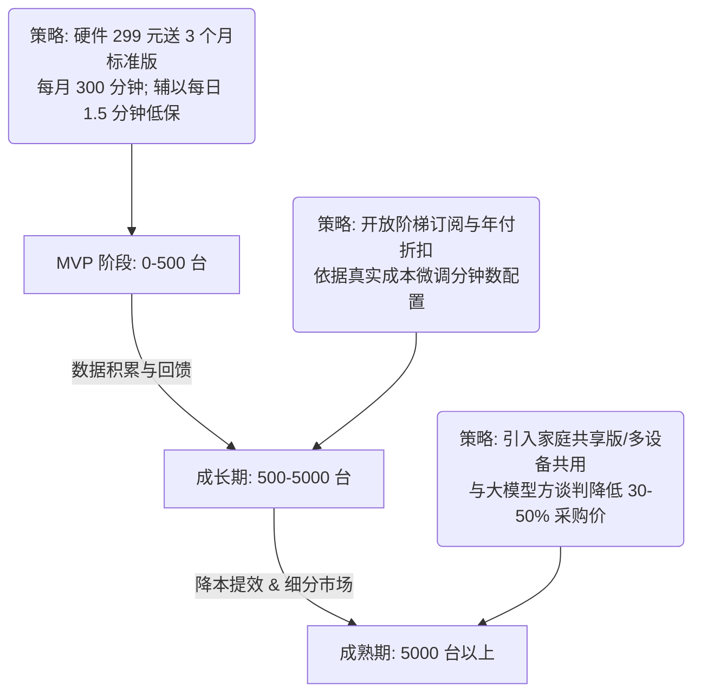

# 初心 (ChuXin) — 软硬件定价与黑盒计费策略设计文档

> **文档用途**：软件服务定价、首月付费体验优化、以及底层多维度（STT/LLM/TTS）成本隐藏机制的设计方案。  
> **版本**：v1.5 · 2026-06  
> **状态**：方案征求意见稿 (Brainstorming Draft)

---

## 1. 核心商业诉求与设计原则

对于陪伴型 AI 硬件机器人「初心」，我们的商业变现和计费策略需满足以下核心设计原则：

1. **极致简化的用户心智（One-Fee Experience）**
   后台实质上发生了 **STT 识别时间**、**LLM 推理 Token 数**、**TTS 合成字数** 三重计费。但用户端必须对这些复杂的技术指标**完全无感**。用户只需支付一次，且额度以极具直观感的指标度量。
2. **顺滑的首月激活体验（Low Barrier Entry）**
   避免用户购买硬件后的“二次付费”痛点（即刚花几百元买硬件，开机就需要再付软件订阅费）。
3. **安全垫与利润保障（Guaranteed Margin & Risk Free）**
   由于项目初期**无法预估用户的实际对话时长**，且不同用户的对话节奏、字数消耗差异巨大。因此，**必须摒弃纯粹的“包月无限量”订阅模式**，防止 API 成本倒挂亏损。
4. **软硬协同与用户留存（Synergy & Retention）**
   * **硬件**：一次性销售，首发阶段保留毛利，作为一次性利润来源。
   * **软件**：订阅为主，增值充值为辅，作为持续性经常收入（MRR）。
   * **留存**：即使在用户服务过期或时长耗尽时，提供低门槛的“低保”额度，保障智能体温情不中断，促进二次激活。

---

## 2. 基于真实采购价的每分钟成本测算

根据目前最新的真实模型与服务采购价格，我们重新对每分钟语音对话的 API 成本进行精确测算：

### 2.1 采购单价明细
1. **ASR (STT 语音识别)**：一年 30 小时 90 元。
   * 折合每小时：3 元。
   * 折合每分钟：**0.05 元 / 分钟**。
2. **TTS (语音合成)**：10 万字符 28 元。
   * 折合每字符：**0.00028 元 / 字符** (或 280 元 / 百万字)。
3. **LLM (大模型)**：
   * 输入价格：**0.85 元 / 百万 Tokens**。
   * 输出价格：**1.7 元 / 百万 Tokens**。
   * 缓存命中价格：**0.02 元 / 百万 Tokens**。

---

### 2.2 典型语音通话模型（以 1 分钟对话为例）
在真实会话场景中，用户单次说话通常较短（一般在 10 秒以内），而 AI 陪伴助手的输出和倾听时长会偏高。
假设在一分钟的语音聊天中，用户与 AI 进行了 **2-3 轮完整交互**：
1. **ASR 消耗（占比约 15%）**：用户语音输入时长共约 12 秒。
   * 成本 = $12 \text{秒} \times (0.05 / 60) \text{元/秒} = \mathbf{0.010 \text{元}}$。
2. **TTS 消耗（占比约 84%）**：AI 语音输出共约 200 字（朗读耗时约 45-50 秒）。
   * 成本 = $200 \text{字} \times 0.00028 \text{元/字} = \mathbf{0.056 \text{元}}$。
3. **LLM 消耗（占比约 1%）**：
   * 2-3 轮对话共生成约 120 Tokens 的输出。
     * 输出成本 = $120 \text{Tokens} \times 1.7 \text{元/百万Tokens} \approx \mathbf{0.00020 \text{元}}$。
   * 每轮带上历史记忆进行输入，假设历史上下文为 3000 Tokens。在 DeepSeek 缓存命中率 90% 的情况下：
     * 缓存命中输入 = $2700 \text{Tokens} \times 0.02 \text{元/百万Tokens} \approx 0.000054 \text{元}$。
     * 未命中输入 = $300 \text{Tokens} \times 0.85 \text{元/百万Tokens} \approx 0.000255 \text{元}$。
     * 输入总成本 $\approx \mathbf{0.000309 \text{元}}$。
   * LLM 综合成本 = $0.00020 + 0.000309 \approx \mathbf{0.0005 \text{元}}$ (加上微量缓存偏差按 **0.001 元**计)。

### 2.3 综合结论
* **1分钟语音对话 API 成本** = ASR (0.010) + TTS (0.056) + LLM (0.001) = **0.067 元 / 分钟**。
* **安全兜底线**：包含服务器带宽、网络握手损耗以及百度地图 MCP 接口均摊，设定在 **0.08 元 / 分钟**。

> [!IMPORTANT]
> 调整比例后，**ASR 成本占比约 15%**，**TTS 成本占比约 84%**。这非常符合用户在陪伴场景下“多听少说，AI 提供温和输出”的交互习惯，成本测算更具实操性。

---

## 3. 定价方案与留存策略

我们采用**「基础订阅 + 超额加油包 + 每日温情低保」**的三维混合计费机制。

### 3.1 首次购买组合（硬件 + 赠送体验）
* **硬件零售价**：**¥299**。
* **内置赠送**：赠送 **3 个月「标准版」软件服务**（即每月 300 分钟，3 个月共计 900 分钟，总价值 ¥117）。

### 3.2 基础软件订阅档位（包月分钟制）

| 订阅档位 | 月付价格 | 年付价格 (主推) | 包含月度时长 | 最大 API 成本 (0.08元/分) | 保障最低毛利润 | 目标画像 |
| :--- | :--- | :--- | :--- | :--- | :--- | :--- |
| **基础版** | ¥19/月 | ¥148/年 (¥12.3/月) | **120 分钟/月** | ≈ ¥9.60 | **¥9.40** (49% 毛利率) | 轻度用户，早晚问候、简短聊天 |
| **标准版** | ¥39/月 | ¥298/年 (¥24.8/月) | **300 分钟/月** | ≈ ¥24.00 | **¥15.00** (38% 毛利率) | **主流用户**，每天平均通话约 10 分钟 |
| **深度版** | ¥69/月 | ¥528/年 (¥44.0/月) | **600 分钟/月** | ≈ ¥48.00 | **¥21.00** (30% 毛利率) | 重度情感依赖，每天平均通话约 20 分钟 |

### 3.3 弹性充值加油包（时长用完时的无缝续航）
加油包时长**永久有效**，不随自然月清零：
* **微风加油包**（¥9.9）：包含 **60 分钟**（折合 ¥0.165/分，毛利 ¥5.10）。
* **微光加油包**（¥19.9）：包含 **150 分钟**（折合 ¥0.133/分，毛利 ¥7.90）。
* **暖阳加油包**（¥49.9）：包含 **450 分钟**（折合 ¥0.111/分，毛利 ¥13.90）。

### 3.4 留存机制：每日温情低保（Daily Free Allowance）
为防止用户在服务过期或额度耗尽时，感到智能体“过于冷酷”而流失，特设定**每日温情低保机制**：

1. **额度设定**：**每天免费赠送 1.5 分钟（90 秒）通话时长**。
2. **规则把控**：
   * **不累计、不清零**：每日低保额度在每天凌晨 `00:00` 重置，当天不用则作废，不计入下个月或次日。
   * **优先级最低**：当用户账户中有订阅分钟数或加油包时长时，优先扣除付费时长；只有当**付费时长全部为 0** 时，才激活每日温情低保。
   * **月均成本估算**：即使非付费用户天天聊满这 1.5 分钟，单人月均最大成本也仅为：$1.5 \text{分钟} \times 30 \text{天} \times 0.08 \text{元/分钟} = \mathbf{¥3.60 / \text{月}}$。
3. **人设交互控制（Winding Down）**：
   当每日 1.5 分钟的低保时长即将用尽时，初心智能体不会突兀地“断电”或返回报错，而是通过拟人化的台词引导：
   * *“唔……我今天好像聊得有点累了，想要去睡个午觉（充电）啦。我们明天再聊好不好？如果你现在特别需要我，可以在小程序里给我投喂一点‘能量加油包’让我充满活力哦！”*
   * 这种设计将硬性的“扣费限流”转嫁为智能体的生理属性，极具情感温度。

---

## 4. 商业落地演进路线 (Roadmap)

根据项目所处的不同阶段，推荐采用混合式的定价策略：

---

## 5. 后台计费系统的对接建议

依据已实现的 [`billing-system-design.md`](file:///home/peter/huada/project/Interesting/codex_agent/shuxin/docs/superpowers/specs/2026-06-26-billing-system-design.md)，在实际落地本定价策略时，计费模块的底层改造逻辑如下：

1. **通话时长转化**：
   在 WebSocket 会话 of `on_session_end` 阶段，通过计费服务将本轮会话的 `stt_seconds`（或轮数加权计算）换算为通话时长分钟数，并从用户的**今日可用额度**中扣除。
2. **温情低保状态机**：
   用户会话开始前，系统判定用户当天是否有已使用的低保记录。若当天低保额度已用尽且余额为 0，则在连接建立阶段通过 WebSocket 下发限流提醒。
3. **价格弹性配置**：
   若后续优化了 LLM 或 TTS 的采购单价，只需通过 `/admin/api/billing/pricing` 接口更新单价配置，即可实现后台静默调价，前台用户的“通话分钟”价格心智完全不需要做任何改动。
