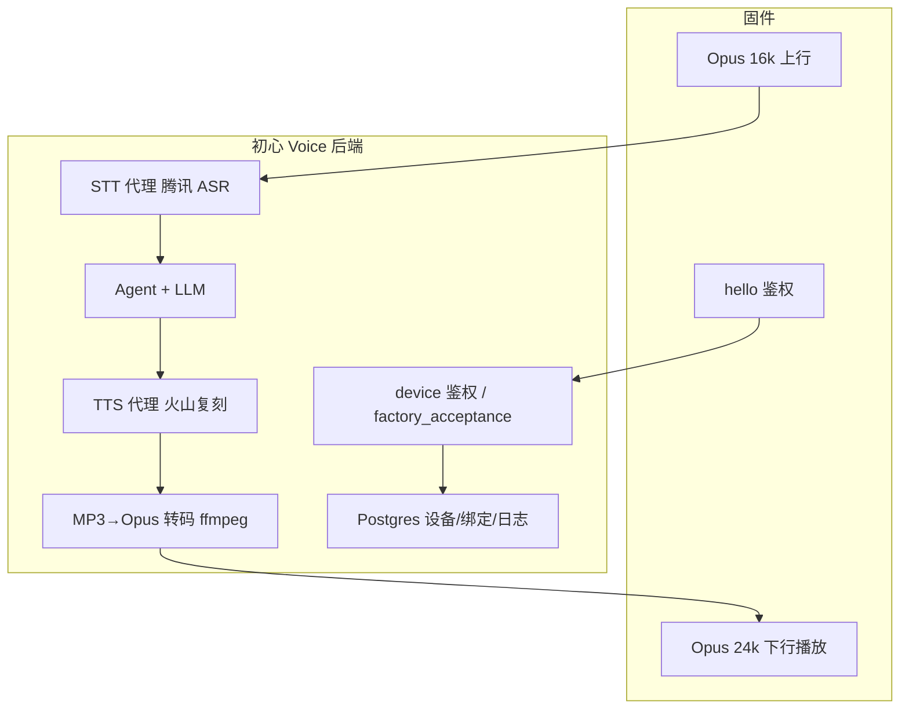
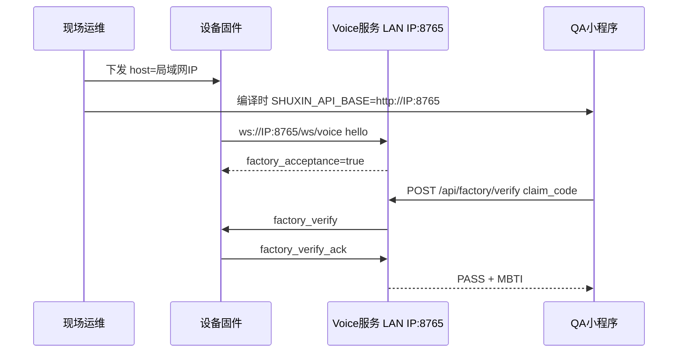
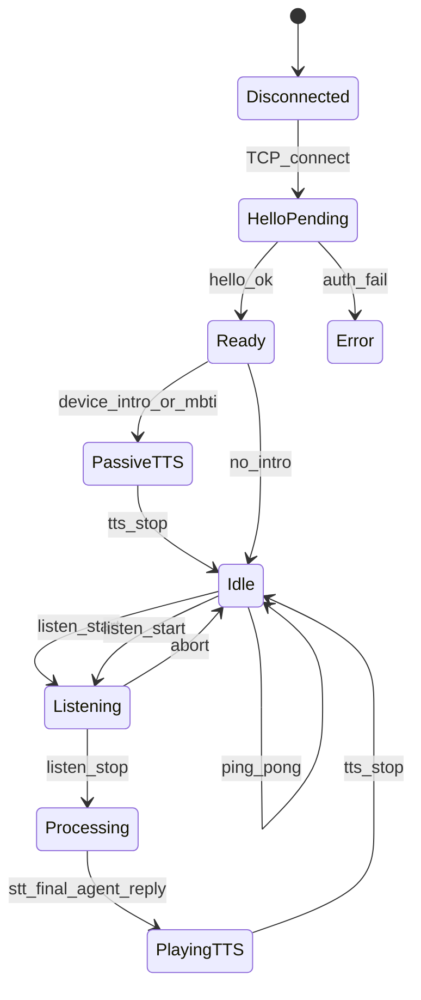
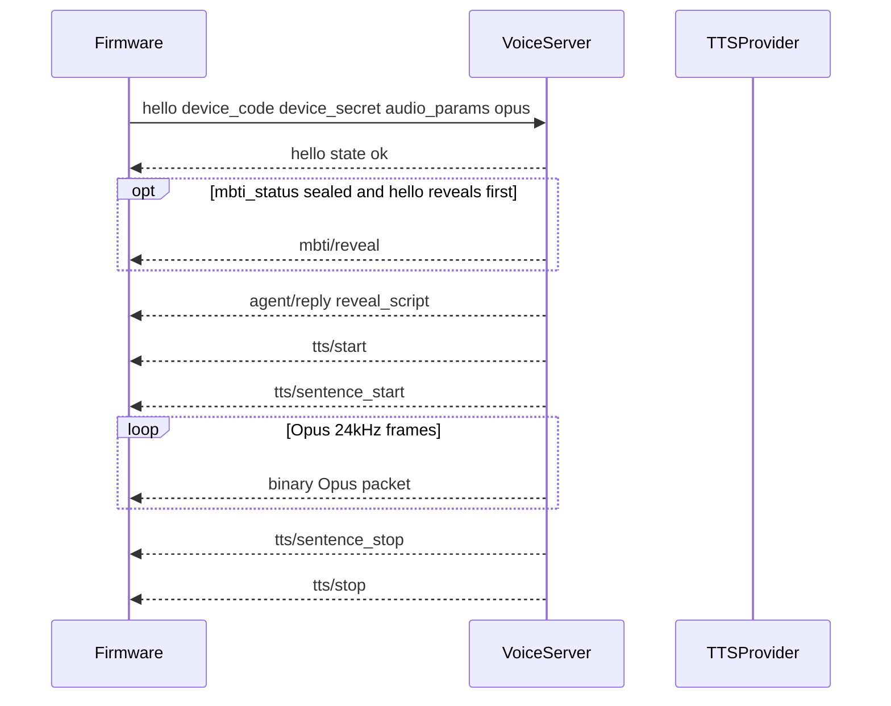
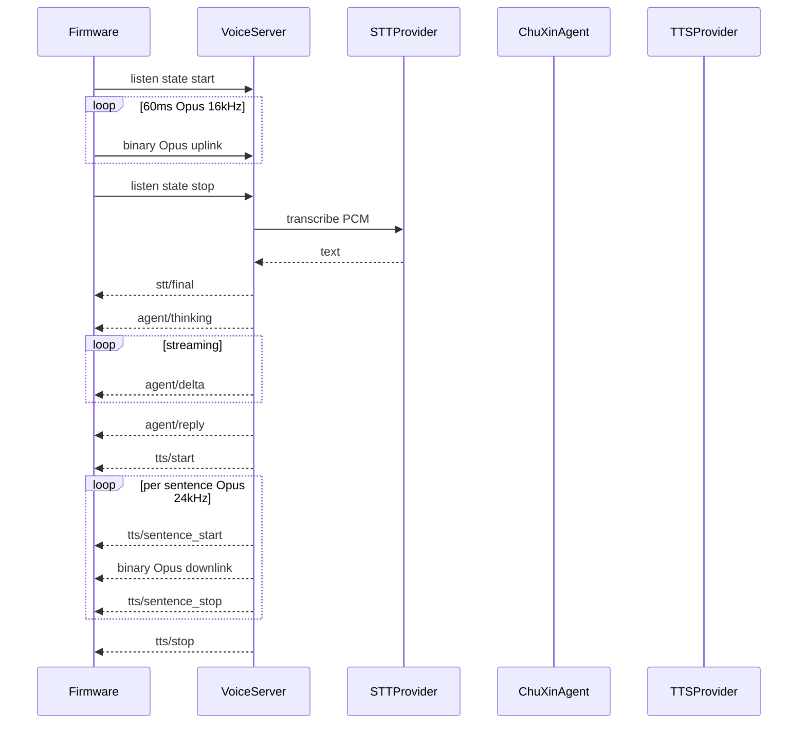

# 初心硬件对接总手册

> **读者**：固件工程师、工厂/测试、硬件项目经理。  
> **版本**：v1.2（2026-06-13）  
> **定位**：硬件方**唯一入口**——端到端流程、职责边界、固件状态机；字段/API 详表见子文档。

## 文档分工

| 文档 | 用途 |
|------|------|
| **本手册 §2** | **初心 Voice 后端能力总览**（固件连什么、云端做什么） |
| **本手册其余章节** | 流程、状态机、验收清单 |
| [VOICE_HARDWARE_QUICKSTART.md](VOICE_HARDWARE_QUICKSTART.md) | 固件 1 页速查（hello / listen / Opus 参数） |
| [VOICE_HARDWARE_INTEGRATION.md](VOICE_HARDWARE_INTEGRATION.md) | 鉴权、STT/TTS BFF、三码模型、常见错误详表 |
| [VOICE_HARDWARE_WS_PROTOCOL.md](VOICE_HARDWARE_WS_PROTOCOL.md) | WebSocket 消息字段、Admin/小程序 API |
| [**FACTORY_ACCEPTANCE_HANDOFF.md**](FACTORY_ACCEPTANCE_HANDOFF.md) | **出厂验收**：未绑定设备 hello、`factory_verify` 固件 5 步 |
| [VOICE_DEMO_MIN_TEST.md](VOICE_DEMO_MIN_TEST.md) | 内部联调/QA（含 Admin curl、Docker 冒烟） |

---

## 1. 职责边界

| 角色 | 负责 | 交付物 |
|------|------|--------|
| **工厂/云端** | 批量制码、贴外壳码 | `device_id`、`device_secret`（烧录用）、`claim_code`（贴外壳） |
| **固件** | 烧录凭证、WebSocket 协议、音频编解码 | 固件含 `device_code` + `device_secret`；支持 Opus 16k↑ / 24k↓ |
| **云端 Voice** | 鉴权、STT/TTS/LLM 代理、MBTI 开箱 TTS | `ws://<host>:8765/ws/voice`；云厂商密钥仅存服务端 |
| **小程序** | 用户绑定；工厂 QA 扫 `claim_code` 验收 | `session_token` + `claim_code` → binding 或 `POST /api/factory/verify` |
| **用户** | 扫码绑定设备 | 绑定后设备 `hello` 进入对话 |

**红线**：固件**不要**直连腾讯云 ASR、火山 TTS 或 LLM API；**不要**把 `device_secret` 贴在外壳。

---

## 2. 初心 Voice 后端服务说明

本节说明固件工程师需要理解的**云端后端能力**：固件运行时只连 WebSocket；绑定、制码、QA 验收由小程序 / Admin 完成。JSON 字段全表见子文档，此处不重复。

### 2.1 固件只需知道的入口

| 用途 | 地址 | 固件是否直连 |
|------|------|--------------|
| 语音 WebSocket | `ws://<host>:8765/ws/voice` | **是（唯一运行时通道）** |
| 健康检查 | `http://<host>:8765/health` | 可选（联调） |
| 小程序绑定 / QA 验收 | `POST /api/...` | **否**（用户手机 / 工厂 QA App） |
| Admin 制码 | `POST /admin/api/...` | **否**（工厂 IT） |

### 2.2 后端在整条链路里做什么（BFF）



固件**不持有**腾讯云 / 火山 / LLM 密钥。云端在 `_ensure_runtime()` 中按绑定用户的 `llm_config`、`agent_id` 装配 STT/TTS；设备 `metadata.mbti` 仅影响语气差异。

### 2.3 两种 WebSocket 会话模式

| 模式 | 条件 | hello 特征 | 固件允许 |
|------|------|------------|----------|
| **出厂验收** | `provisioned` + 无 active binding | `factory_acceptance: true` | `ping` / `factory_verify_ack` / `abort`；**禁止** `listen` |
| **正常对话** | 用户已小程序绑定 | `state: ok`，无 `factory_acceptance` | `listen` + Opus 帧 + 被动 TTS（MBTI intro） |

出厂路径详表：[FACTORY_ACCEPTANCE_HANDOFF.md](FACTORY_ACCEPTANCE_HANDOFF.md)。固件在验收阶段**收什么 / 不收什么**见 [§2.11](#211-出厂验收各方知道什么)。

### 2.4 一轮对话后端事件（绑定后）

固件动作与后端下行事件对应关系见 [§6.2](#62-用户发起一轮对话)。摘要：

1. `listen start` → 收 Opus 帧 → `listen stop`
2. `stt/start` → `stt/final`（或 realtime `partial` / `sentence_final`）
3. `agent/thinking` → `agent/delta` → `agent/reply`
4. `tts/start` → 每句 `sentence_start` → **二进制 Opus** → `sentence_stop` → `tts/stop`

下行 TTS：云端火山合成 MP3 → 服务端 ffmpeg 转 PCM → Opus 分包（每帧 ≤ `SHUXIN_WS_DOWNLINK_MAX_BYTES`，默认 2048B）。固件**不需要 ffmpeg**。见 [VOICE_HARDWARE_TTS_DOWNLINK.md](VOICE_HARDWARE_TTS_DOWNLINK.md)。

**括弧动作**：`sentence_start.text` 可能含 `（微笑）` 等；TTS 音频已剥离动作，但 JSON 仍带原文供固件触发动作（纯动作句可能无音频帧）。

### 2.5 音频格式约定（wire format）

| 方向 | 格式 | 采样率 | 帧长 |
|------|------|--------|------|
| 上行 | raw Opus（无 Ogg 头） | 16 kHz mono | 60 ms |
| 下行 WS TTS | raw Opus | 24 kHz mono | 60 ms |
| 本地 Flash 提示音 | `.opus.bin` 预烧录 | 16 kHz / 16 kbps | 与 WS 分离 |

每个 WebSocket binary 消息 = **一帧 Opus**，不是整段 Ogg/wav/mp3 文件。Flash 提示音不经过 WebSocket，见 [§7](#7-音频双路径)。

### 2.6 后端数据与隐私边界

| 数据 | 保留策略 | 固件影响 |
|------|----------|----------|
| 用户输入 wav / 回复 mp3 | 默认 **12h** TTL（`SHUXIN_AUDIO_RETENTION_HOURS`） | 无；仅服务端排障 |
| 对话文字 `conversation_events` | 长期（记忆体系用） | 无 |
| 工厂验收日志 `factory_verify_logs` | 默认 **15 天**（`SHUXIN_FACTORY_VERIFY_LOG_RETENTION_DAYS`） | 无；QA 小程序查历史 |

固件不落盘用户语音；上行仅在服务端短期缓存用于 STT。

### 2.7 固件红线

- 不直连腾讯云 ASR / 火山 TTS / LLM
- 不把 `device_secret` 贴外壳；不烧录 `claim_code` 当密钥
- `client_id` 不要用 `web-demo`（会走 PCM/mp3 浏览器测试路径）
- 收到 `hello ok` 前不发 `listen` 或音频帧
- 出厂模式不发 `listen`

### 2.8 常见后端错误 → 固件侧首要排查

| 后端返回 | 固件/烧录侧查 |
|----------|---------------|
| `invalid device secret` | `device_secret` 与制码不一致 / 轮换后未重烧 |
| `device is not bound or disabled` | 用户未绑定（非出厂路径） |
| `factory acceptance mode: conversation disabled` | 出厂模式误发 `listen` |
| `no audio received` | `listen stop` 前未发 Opus 帧 |
| `opus support requires opuslib_next` | 服务端需 redeploy（非固件问题） |
| QA `device_offline` | hello 后 WS 断开 |
| QA `ack_timeout` | 10s 内未回 `factory_verify_ack` |

详表见 [VOICE_HARDWARE_INTEGRATION.md §4](VOICE_HARDWARE_INTEGRATION.md)。

### 2.9 延伸阅读（字段级）

- WS 消息 JSON 全表：[VOICE_HARDWARE_WS_PROTOCOL.md](VOICE_HARDWARE_WS_PROTOCOL.md)
- TTS 下行与动作过滤：[VOICE_HARDWARE_TTS_DOWNLINK.md](VOICE_HARDWARE_TTS_DOWNLINK.md)
- 1 页速查：[VOICE_HARDWARE_QUICKSTART.md](VOICE_HARDWARE_QUICKSTART.md)
- 固件如何获取接口与局域网联调：[§2.10](#210-固件如何获取并连接接口)

### 2.10 固件如何获取并连接接口

**核心结论**：

```text
固件运行时唯一通道：ws://<host>:8765/ws/voice
固件不需要、也不应调用 HTTP API / 小程序 session_token / claim_code
```

#### 各项凭证由谁提供

| 项 | 谁提供 | 固件怎么用 |
|----|--------|------------|
| `<host>` | 工厂 IT / 现场运维（局域网 IP 或日后正式域名） | 建议 NVS / 产测可写，**勿写死**；当前阶段多为 `192.168.x.x` |
| 端口 | 固定 `8765` | 与 Voice Docker 映射一致 |
| `device_code` + `device_secret` | Admin `POST /admin/api/factory/devices/batch` 制码 → 烧录工具写入固件 | `hello` JSON 字段 |
| `claim_code` | 贴外壳，**不进固件** | 固件无需知晓 |

#### 联调前自检

```bash
curl -s http://<host>:8765/health    # 应返回 OK / storage 信息
# 可选：websocat 发 hello 验证 factory_acceptance
```

#### 固件不涉及的 HTTP 接口

| 接口 | 使用者 | 固件是否调用 |
|------|--------|--------------|
| `POST /api/factory/verify` | 工厂 QA 小程序 | **否** |
| `POST /api/devices/bind` | 用户小程序绑定 | **否**（出厂验收禁止绑定） |
| `POST /admin/api/...` | 工厂 IT / Admin 浏览器 | **否** |

制码、Admin curl 详表见 [VOICE_DEMO_MIN_TEST.md §9](VOICE_DEMO_MIN_TEST.md)。

#### 局域网本地联调 SOP（当前无公网域名阶段）

现场常见部署：同一局域网内一台已运行 Voice Docker 的服务器/工控机。固件与 QA 小程序须指向**同一** `<host>:8765`。



**步骤清单**：

1. 运维确认 Voice 容器运行，`curl http://<LAN_IP>:8765/health` 成功
2. 固件配置 `host=<LAN_IP>`，上电 `hello` → 响应含 `factory_acceptance: true`，**保持 WS 不断**
3. QA 侧：设置 `SHUXIN_API_BASE=http://<LAN_IP>:8765` 后执行 `scripts/wechat_miniprogram_dev.sh build`（与 [VOICE_HARDWARE_WS_PROTOCOL.md](VOICE_HARDWARE_WS_PROTOCOL.md) 一致）
4. QA 小程序扫外壳 `claim_code` → 设备收 `factory_verify` → 10s 内 `factory_verify_ack`
5. QA 手机显示 PASS + MBTI，与盒内人格卡片肉眼核对

**无真机备选**：同一 `host` 下用 `voice-demo` 保持连接（已内置自动 ack），见 [VOICE_DEMO_MIN_TEST.md §9.2.2](VOICE_DEMO_MIN_TEST.md)。

**正式上线后**：仅将 `<host>` 换为正式域名；协议路径 `/ws/voice` 与端口 `8765` 不变。

### 2.11 出厂验收：各方知道什么

出厂验收验的是「外壳码 ↔ 在线设备身份 ↔ 设备密钥」三码一致；MBTI 性格由 **QA 人眼**核对（手机 vs 盒内卡片），**不通过 WebSocket 下发给固件**（盲盒仍 `sealed`）。

#### 信息认知边界

| 数据 | 固件 | QA 小程序 | 盒内卡片 | 验收后 DB |
|------|------|-----------|----------|-----------|
| `device_id` | 烧录 + hello 回显 | PASS 响应 | 无 | 有 |
| `claim_code` | **不知** | 扫码输入 | 无（在外壳） | 有 |
| MBTI | **不知**（sealed） | PASS 时显示 | 印刷 | sealed |
| `factory_verify` | **收**（仅触发） | 不直接收 | 无 | 日志 |

#### 固件下行消息摘要

| 消息 | 含 `device_id` | 含 MBTI | 固件动作 |
|------|----------------|---------|----------|
| `hello ok` + `factory_acceptance` | **是**（回显） | **否** | 进入出厂模式，保持连接 |
| `factory_verify` | **否** | **否** | 本地 PASS 提示 → `factory_verify_ack` |

固件**不要**期待性格揭晓 TTS；`factory_verify` 仅为验收触发，不含 PASS 详情。

#### 与绑定后对比

| | 出厂验收 | 用户绑定后 |
|--|---------|------------|
| 固件协议 | 仅 WS：`factory_verify` / `ping` / `abort` | WS 对话 + TTS |
| 性格揭晓 | 无（sealed） | bind / hello 揭晓 → `locked` |
| MBTI 谁先看 | QA（HTTP PASS 响应） | 用户（开箱体验） |

固件 5 步实现详表：[FACTORY_ACCEPTANCE_HANDOFF.md](FACTORY_ACCEPTANCE_HANDOFF.md)。

---

## 3. 三码模型（简表）

| 凭证 | 持有者 | 用途 | 能否贴外壳 |
|------|--------|------|------------|
| `claim_code` | 外壳条形码 | 小程序绑定 | 是 |
| `device_code`（= `device_id`） | 固件 | WebSocket `hello` | 否 |
| `device_secret` | 固件 | WebSocket `hello` 鉴权 | 否 |

详述见 [VOICE_HARDWARE_INTEGRATION.md §3](VOICE_HARDWARE_INTEGRATION.md)。

---

## 4. 端到端操作流程

### 4.1 出厂工厂验收（未绑定）

```text
1. 工厂制码     → device_id + device_secret + claim_code + mbti（sealed）
2. 固件烧录     → 写入 device_code + device_secret（不烧录 claim_code）
3. 外壳贴码     → 仅 claim_code
4. 设备 hello   → factory_acceptance=true，保持 WS 连接
5. QA 扫码      → factory_verify → 固件 factory_verify_ack → PASS + MBTI 卡片核对
```

固件详表见 [FACTORY_ACCEPTANCE_HANDOFF.md](FACTORY_ACCEPTANCE_HANDOFF.md)；固件收什么 / 不收什么见 [§2.11](#211-出厂验收各方知道什么)；局域网 host 与双路径联调见 [§2.10](#210-固件如何获取并连接接口)；内部 QA 见 [VOICE_DEMO_MIN_TEST.md §9.2.2](VOICE_DEMO_MIN_TEST.md)。

### 4.2 用户绑定与正常对话

```text
1. 工厂制码     → device_id + device_secret + claim_code（+ MBTI sealed）
2. 固件烧录     → 写入 device_code + device_secret
3. 外壳贴码     → 仅 claim_code / 二维码
4. 用户绑定     → 小程序扫码 claim_code
5. 设备 hello   → 鉴权通过，可能收到首次 MBTI 自我介绍 TTS
6. 正常对话     → listen start → Opus 帧 → listen stop → STT/Agent/TTS
```

### Checklist（出厂验收）

- [ ] 设备 `provisioned`，无 active binding
- [ ] `hello` 响应含 `factory_acceptance: true`
- [ ] hello 后保持连接，不发 `listen`
- [ ] 收到 `factory_verify` 后 10s 内回 `factory_verify_ack`
- [ ] QA PASS 后 DB 仍 `mbti_status=sealed`，无 `device_bindings`

### Checklist（用户绑定后）

- [ ] 服务端 Voice 已部署，`/health` 可达
- [ ] 设备已在 Admin 制码，`device_secret` 已烧录
- [ ] 外壳仅贴 `claim_code`，无 `device_secret`
- [ ] 用户已通过小程序完成绑定
- [ ] 绑定用户的 LLM 已配置（Admin 用户 Tab）
- [ ] 设备 `hello` 收到 `state: ok`
- [ ] 首次连接听到「绑定成功。」+ 自我介绍 TTS（若 `device_intro_played=false`）
- [ ] 按住说话一轮：收到 `stt/final` → `agent/delta` 或 `reply` → TTS 播放

Admin 制码、绑定 curl 与 Docker 联调见 [VOICE_DEMO_MIN_TEST.md §9](VOICE_DEMO_MIN_TEST.md)。

---

## 5. 固件状态机



**要点**：

- 收到 `hello ok` **之前**不要发 `listen` 或音频二进制帧。
- `PassiveTTS`：服务端主动下发，**无需**用户 `listen`（MBTI 开箱 / 绑定成功自我介绍）。
- `abort`：取消当前录音或 TTS 播放，回到 `Idle`。
- `ping`：保活，服务端回 `pong`。

---

## 6. 关键时序

### 6.1 Hello 后被动 TTS（MBTI / 绑定自我介绍）

小程序绑定为主路径；设备首次 `hello` 时若 `device_intro_played=false`，服务端补播 TTS。



- 小程序已绑定且 `mbti_status=locked` 时，通常**不发** `mbti/reveal`，只播「绑定成功。」+ `reveal_script`。
- 绑定瞬间若设备 WS 已在线，绑定 API 也会即时推送同一段 TTS；否则等下次 `hello` 补播。
- `device_intro_played=true` 后不再重复播报。

协议字段见 [VOICE_HARDWARE_WS_PROTOCOL.md §5](VOICE_HARDWARE_WS_PROTOCOL.md)。

### 6.2 用户发起一轮对话



固件在 `PlayingTTS` 期间应能处理 `abort` 打断播放。

---

## 7. 音频双路径

| 场景 | 方向 | 格式 | 采样率 |
|------|------|------|--------|
| WebSocket 实时对话 | 上行 | raw Opus（无 Ogg 头） | 16 kHz mono，60 ms/帧 |
| WebSocket 实时对话 | 下行 | raw Opus | 24 kHz mono，60 ms/帧 |
| Flash 本地 UI 提示音 | 本地播放 | `.opus.bin` 预生成 | 16 kHz / 16 kbps |

- 实时 TTS 与 Flash 提示音**采样率不同**，固件需分别配置解码器。
- Flash 提示音（「待命」「电量不足」等）**不经过 WebSocket**；生成与烧录见 [VOICE_HARDWARE_QUICKSTART.md §5](VOICE_HARDWARE_QUICKSTART.md)，验收见 [VOICE_DEMO_MIN_TEST.md §18](VOICE_DEMO_MIN_TEST.md)。

`hello` 中声明 Opus 协商示例：

```json
{
  "type": "hello",
  "device_code": "<device_id>",
  "device_secret": "<secret>",
  "client_id": "device-001",
  "audio_params": {
    "format": "opus",
    "sample_rate": 16000,
    "channels": 1,
    "frame_duration": 60
  }
}
```

---

## 8. 联调验收清单

1. [ ] `curl http://<host>:8765/health` 返回 OK
2. [ ] 未绑定设备 `hello` → `device is not bound or disabled`
3. [ ] 错误 `device_secret` → `invalid device secret`
4. [ ] 绑定后 `hello` → `state: ok` + `audio_params` 含 Opus 协商
5. [ ] 首次 hello 收到 `tts/start` 并听到自我介绍（MBTI 路径）
6. [ ] `listen start` → 发送 Opus 帧 → `listen stop` → 收到 `stt/final`
7. [ ] 收到 `agent/delta` 或 `agent/reply`，随后 TTS 分句播放
8. [ ] `abort` 可打断录音或 TTS
9. [ ] `ping` 收到 `pong`
10. [ ] 本地 Flash 提示音（若已烧录）与 WS 对话 TTS 互不干扰

无硬件 Opus 冒烟：

```bash
docker exec shuxin-voice-demo-pg python scripts/ws_opus_smoke_test.py \
  --url ws://127.0.0.1:8765/ws/voice \
  --device-code demo-device-001 \
  --device-secret dev-device-secret \
  --input /app/data/test/activation.ogg \
  --output /app/outputs/opus-smoke-reply.wav
```

详见 [VOICE_DEMO_MIN_TEST.md §17](VOICE_DEMO_MIN_TEST.md)。

---

## 9. 常见错误摘要

| 现象 | 首要排查 |
|------|----------|
| `invalid device secret` | 密钥错误或 Admin 轮换后固件未更新 |
| `device is not bound or disabled` | 用户未小程序绑定 |
| `LLM api_key is not configured` | 绑定用户未配 LLM（鉴权已过） |
| hello 有 MBTI 文字无 TTS | 升级含 `_ensure_runtime` 修复的服务端版本 |
| `opus support requires opuslib_next` | 服务端 Docker 未 redeploy |
| `no audio received` | `listen stop` 前未发 Opus/PCM 帧 |
| `agent/error connect_timeout` | 服务端出网或 LLM API 不可达 |

详表见 [VOICE_HARDWARE_INTEGRATION.md §4](VOICE_HARDWARE_INTEGRATION.md)、[VOICE_DEMO_MIN_TEST.md §10](VOICE_DEMO_MIN_TEST.md)。后端能力与固件侧对照见 [§2.8](#28-常见后端错误--固件侧首要排查)。

---

## 10. 附录：文档索引

| 主题 | 文档 |
|------|------|
| 后端能力总览 | **本手册 §2**（含 §2.10 接口获取、§2.11 出厂认知边界） |
| 1 页固件速查 | [VOICE_HARDWARE_QUICKSTART.md](VOICE_HARDWARE_QUICKSTART.md) |
| 鉴权与 BFF 架构 | [VOICE_HARDWARE_INTEGRATION.md](VOICE_HARDWARE_INTEGRATION.md) |
| WS 消息与 Admin API | [VOICE_HARDWARE_WS_PROTOCOL.md](VOICE_HARDWARE_WS_PROTOCOL.md) |
| TTS 下行（Opus 分包） | [VOICE_HARDWARE_TTS_DOWNLINK.md](VOICE_HARDWARE_TTS_DOWNLINK.md) |
| 产品架构与 `_ensure_runtime` | [VOICE_ARCHITECTURE.md §3.4](VOICE_ARCHITECTURE.md) |
| MBTI 盲盒状态机 | [DEVICE_MBTI_BLINDBOX_AND_MEMORY_PLAN.md §5.1](DEVICE_MBTI_BLINDBOX_AND_MEMORY_PLAN.md) |
| Docker 联调与 Admin curl | [VOICE_DEMO_MIN_TEST.md](VOICE_DEMO_MIN_TEST.md) |
| 生产部署 | [DEPLOY_SERVER.md](DEPLOY_SERVER.md) |
