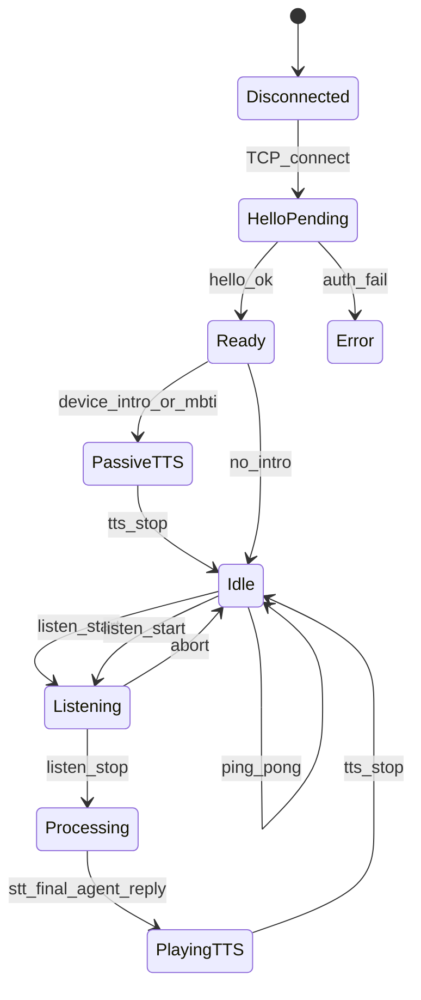
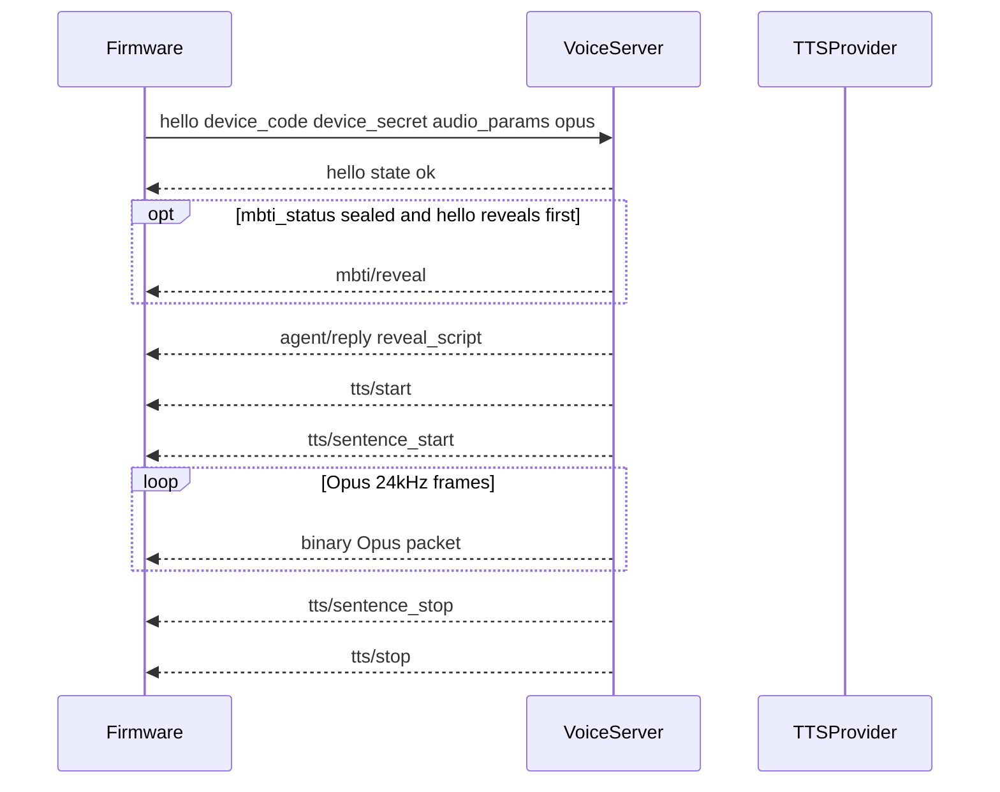
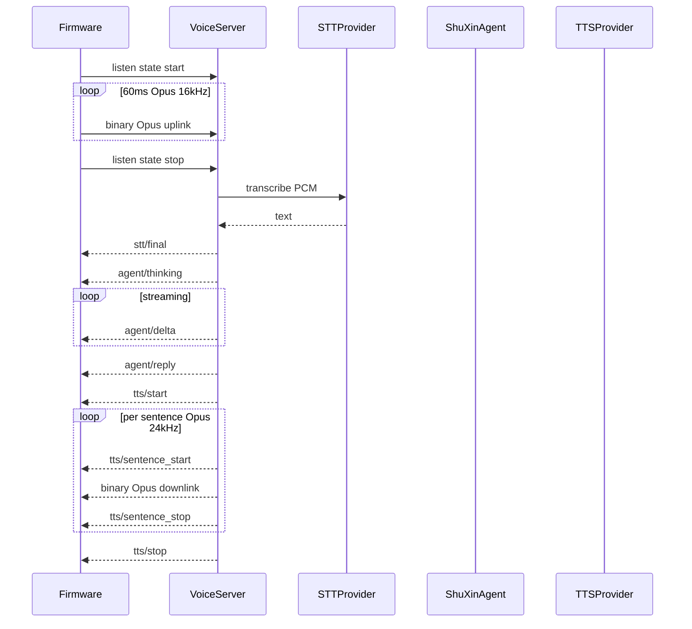

# 舒心硬件对接总手册

> **读者**：固件工程师、工厂/测试、硬件项目经理。  
> **版本**：v1.0（2026-06-08）  
> **定位**：硬件方**唯一入口**——端到端流程、职责边界、固件状态机；字段/API 详表见子文档。

## 文档分工

| 文档 | 用途 |
|------|------|
| **本手册** | 流程、职责、状态机、验收清单 |
| [VOICE_HARDWARE_QUICKSTART.md](VOICE_HARDWARE_QUICKSTART.md) | 固件 1 页速查（hello / listen / Opus 参数） |
| [VOICE_HARDWARE_INTEGRATION.md](VOICE_HARDWARE_INTEGRATION.md) | 鉴权、STT/TTS BFF、三码模型、常见错误详表 |
| [VOICE_HARDWARE_WS_PROTOCOL.md](VOICE_HARDWARE_WS_PROTOCOL.md) | WebSocket 消息字段、Admin/小程序 API |
| [VOICE_DEMO_MIN_TEST.md](VOICE_DEMO_MIN_TEST.md) | 内部联调/QA（含 Admin curl、Docker 冒烟） |

---

## 1. 职责边界

| 角色 | 负责 | 交付物 |
|------|------|--------|
| **工厂/云端** | 批量制码、贴外壳码 | `device_id`、`device_secret`（烧录用）、`claim_code`（贴外壳） |
| **固件** | 烧录凭证、WebSocket 协议、音频编解码 | 固件含 `device_code` + `device_secret`；支持 Opus 16k↑ / 24k↓ |
| **云端 Voice** | 鉴权、STT/TTS/LLM 代理、MBTI 开箱 TTS | `ws://<host>:8765/ws/voice`；云厂商密钥仅存服务端 |
| **小程序** | 用户绑定 | `session_token` + `claim_code` → active binding |
| **用户** | 扫码绑定设备 | 绑定后设备 `hello` 才能进入对话 |

**红线**：固件**不要**直连腾讯云 ASR、火山 TTS 或 LLM API；**不要**把 `device_secret` 贴在外壳。

---

## 2. 三码模型（简表）

| 凭证 | 持有者 | 用途 | 能否贴外壳 |
|------|--------|------|------------|
| `claim_code` | 外壳条形码 | 小程序绑定 | 是 |
| `device_code`（= `device_id`） | 固件 | WebSocket `hello` | 否 |
| `device_secret` | 固件 | WebSocket `hello` 鉴权 | 否 |

详述见 [VOICE_HARDWARE_INTEGRATION.md §3](VOICE_HARDWARE_INTEGRATION.md)。

---

## 3. 端到端操作流程

```text
1. 工厂制码     → device_id + device_secret + claim_code（+ MBTI sealed）
2. 固件烧录     → 写入 device_code + device_secret
3. 外壳贴码     → 仅 claim_code / 二维码
4. 用户绑定     → 小程序扫码 claim_code
5. 设备 hello   → 鉴权通过，可能收到首次 MBTI 自我介绍 TTS
6. 正常对话     → listen start → Opus 帧 → listen stop → STT/Agent/TTS
```

### Checklist

- [ ] 服务端 Voice 已部署，`/health` 可达
- [ ] 设备已在 Admin 制码，`device_secret` 已烧录
- [ ] 外壳仅贴 `claim_code`，无 `device_secret`
- [ ] 用户已通过小程序完成绑定
- [ ] 绑定用户的 LLM 已配置（Admin 用户 Tab）
- [ ] 设备 `hello` 收到 `state: ok`
- [ ] 首次连接听到「绑定成功。」+ 自我介绍 TTS（若 `device_intro_played=false`）
- [ ] 按住说话一轮：收到 `stt/final` → `agent/delta` 或 `reply` → TTS 播放

Admin 制码、绑定 curl 与 Docker 联调见 [VOICE_DEMO_MIN_TEST.md §9](VOICE_DEMO_MIN_TEST.md)。

---

## 4. 固件状态机



**要点**：

- 收到 `hello ok` **之前**不要发 `listen` 或音频二进制帧。
- `PassiveTTS`：服务端主动下发，**无需**用户 `listen`（MBTI 开箱 / 绑定成功自我介绍）。
- `abort`：取消当前录音或 TTS 播放，回到 `Idle`。
- `ping`：保活，服务端回 `pong`。

---

## 5. 关键时序

### 5.1 Hello 后被动 TTS（MBTI / 绑定自我介绍）

小程序绑定为主路径；设备首次 `hello` 时若 `device_intro_played=false`，服务端补播 TTS。



- 小程序已绑定且 `mbti_status=locked` 时，通常**不发** `mbti/reveal`，只播「绑定成功。」+ `reveal_script`。
- 绑定瞬间若设备 WS 已在线，绑定 API 也会即时推送同一段 TTS；否则等下次 `hello` 补播。
- `device_intro_played=true` 后不再重复播报。

协议字段见 [VOICE_HARDWARE_WS_PROTOCOL.md §5](VOICE_HARDWARE_WS_PROTOCOL.md)。

### 5.2 用户发起一轮对话



固件在 `PlayingTTS` 期间应能处理 `abort` 打断播放。

---

## 6. 音频双路径

| 场景 | 方向 | 格式 | 采样率 |
|------|------|------|--------|
| WebSocket 实时对话 | 上行 | raw Opus（无 Ogg 头） | 16 kHz mono，60 ms/帧 |
| WebSocket 实时对话 | 下行 | raw Opus | 24 kHz mono，60 ms/帧 |
| Flash 本地 UI 提示音 | 本地播放 | `.opus.bin` 预生成 | 16 kHz / 16 kbps |

- 实时 TTS 与 Flash 提示音**采样率不同**，固件需分别配置解码器。
- Flash 提示音（「待命」「电量不足」等）**不经过 WebSocket**；生成与烧录见 [VOICE_HARDWARE_QUICKSTART.md §5](VOICE_HARDWARE_QUICKSTART.md)，验收见 [VOICE_DEMO_MIN_TEST.md §18](VOICE_DEMO_MIN_TEST.md)。

`hello` 中声明 Opus 协商示例：

```json
{
  "type": "hello",
  "device_code": "<device_id>",
  "device_secret": "<secret>",
  "client_id": "device-001",
  "audio_params": {
    "format": "opus",
    "sample_rate": 16000,
    "channels": 1,
    "frame_duration": 60
  }
}
```

---

## 7. 联调验收清单

1. [ ] `curl http://<host>:8765/health` 返回 OK
2. [ ] 未绑定设备 `hello` → `device is not bound or disabled`
3. [ ] 错误 `device_secret` → `invalid device secret`
4. [ ] 绑定后 `hello` → `state: ok` + `audio_params` 含 Opus 协商
5. [ ] 首次 hello 收到 `tts/start` 并听到自我介绍（MBTI 路径）
6. [ ] `listen start` → 发送 Opus 帧 → `listen stop` → 收到 `stt/final`
7. [ ] 收到 `agent/delta` 或 `agent/reply`，随后 TTS 分句播放
8. [ ] `abort` 可打断录音或 TTS
9. [ ] `ping` 收到 `pong`
10. [ ] 本地 Flash 提示音（若已烧录）与 WS 对话 TTS 互不干扰

无硬件 Opus 冒烟：

```bash
docker exec shuxin-voice-demo-pg python scripts/ws_opus_smoke_test.py \
  --url ws://127.0.0.1:8765/ws/voice \
  --device-code demo-device-001 \
  --device-secret dev-device-secret \
  --input /app/data/test/activation.ogg \
  --output /app/outputs/opus-smoke-reply.wav
```

详见 [VOICE_DEMO_MIN_TEST.md §17](VOICE_DEMO_MIN_TEST.md)。

---

## 8. 常见错误摘要

| 现象 | 首要排查 |
|------|----------|
| `invalid device secret` | 密钥错误或 Admin 轮换后固件未更新 |
| `device is not bound or disabled` | 用户未小程序绑定 |
| `LLM api_key is not configured` | 绑定用户未配 LLM（鉴权已过） |
| hello 有 MBTI 文字无 TTS | 升级含 `_ensure_runtime` 修复的服务端版本 |
| `opus support requires opuslib_next` | 服务端 Docker 未 redeploy |
| `no audio received` | `listen stop` 前未发 Opus/PCM 帧 |
| `agent/error connect_timeout` | 服务端出网或 LLM API 不可达 |

详表见 [VOICE_HARDWARE_INTEGRATION.md §4](VOICE_HARDWARE_INTEGRATION.md)、[VOICE_DEMO_MIN_TEST.md §10](VOICE_DEMO_MIN_TEST.md)。

---

## 9. 附录：文档索引

| 主题 | 文档 |
|------|------|
| 1 页固件速查 | [VOICE_HARDWARE_QUICKSTART.md](VOICE_HARDWARE_QUICKSTART.md) |
| 鉴权与 BFF 架构 | [VOICE_HARDWARE_INTEGRATION.md](VOICE_HARDWARE_INTEGRATION.md) |
| WS 消息与 Admin API | [VOICE_HARDWARE_WS_PROTOCOL.md](VOICE_HARDWARE_WS_PROTOCOL.md) |
| 产品架构与 `_ensure_runtime` | [VOICE_ARCHITECTURE.md §3.4](VOICE_ARCHITECTURE.md) |
| MBTI 盲盒状态机 | [DEVICE_MBTI_BLINDBOX_AND_MEMORY_PLAN.md §5.1](DEVICE_MBTI_BLINDBOX_AND_MEMORY_PLAN.md) |
| Docker 联调与 Admin curl | [VOICE_DEMO_MIN_TEST.md](VOICE_DEMO_MIN_TEST.md) |
| 生产部署 | [DEPLOY_SERVER.md](DEPLOY_SERVER.md) |
