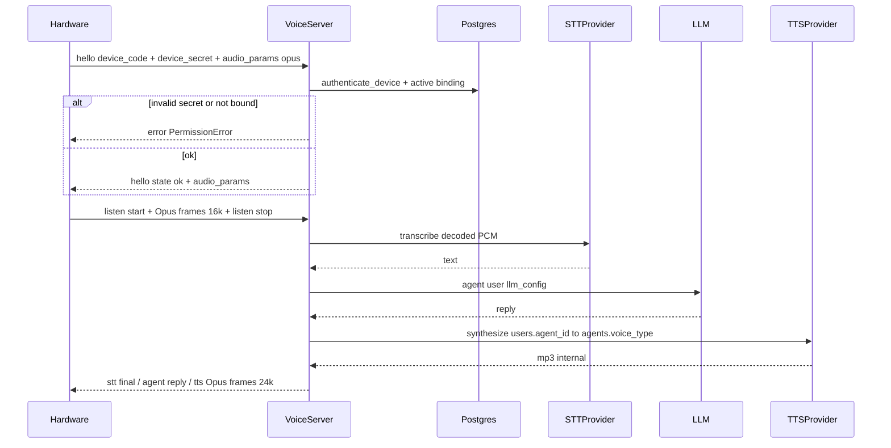

# 硬件 STT/TTS 调用与鉴权接入指南

本文档面向硬件/固件工程师、工厂烧录与联调测试。说明设备如何经舒心 Voice 服务间接使用语音识别与合成，以及为何必须先完成设备鉴权与用户绑定。

协议字段与下行消息格式见 [语音硬件 WebSocket 接口协议](VOICE_HARDWARE_WS_PROTOCOL.md)。架构与绑定模型见 [舒心语音闭环与硬件接口架构](VOICE_ARCHITECTURE.md) §6.1。

## 1. 一句话说明

- 设备通过 `ws://<host>:8765/ws/voice` 与舒心 Voice 服务通信。
- **STT、TTS、LLM 均由服务端调用**；设备负责音频上行与下行播放。
- **硬件推荐**：`hello` 声明 `audio_params.format=opus`（上行 16 kHz Opus 帧，下行 24 kHz Opus 帧）。
- **浏览器测试台**：不传 `audio_params`，仍用 PCM16 上行 + mp3 下行。
- 固件**不要**直连腾讯云 ASR、火山 TTS 或 LLM API，也**不要**在设备内保存这些云厂商密钥。

## 2. 调用架构（BFF 代理）



服务端实现要点（便于与文档对照）：

- `hello` 携带 `device_code` / `device_secret` 时调用 `authenticate_device()`（见 `src/shuxin/voice/server.py`）。
- Postgres 模式校验 `device_secret_hash` 与 `device_bindings.status='active'`（见 `src/shuxin/voice/postgres_repository.py`）。
- 鉴权通过后，在 `_ensure_runtime()` 中按设备 STT 配置与用户 `agent_id`（Postgres `agents` 表）创建 STT/TTS Provider；设备 `metadata.mbti` 注入语气差异。

## 3. 三码模型与职责边界

| 码/凭证 | 谁持有 | 用途 | 能否贴外壳 |
|---------|--------|------|------------|
| `claim_code` | 外壳条形码 | 用户小程序绑定 | 是 |
| `device_code` / `device_id` | 设备固件 | WebSocket `hello` | 否 |
| `device_secret` | 设备固件 | WebSocket `hello` 鉴权 | 否 |
| 腾讯云 ASR / 火山 TTS / LLM `api_key` | **仅服务端** | STT / TTS / 对话 | 否 |

- 外壳条形码只暴露 `claim_code`，不包含 `device_id` 或 `device_secret`。
- 用户绑定流程（小程序、`session_token`）见 [VOICE_HARDWARE_WS_PROTOCOL.md §7](VOICE_HARDWARE_WS_PROTOCOL.md) 与 [VOICE_ARCHITECTURE.md §6.1](VOICE_ARCHITECTURE.md)。

## 4. 前置条件（全链路 checklist）

按顺序完成以下步骤后，设备才能稳定跑通语音对话：

| 步骤 | 动作 | 未完成时的典型现象 |
|------|------|-------------------|
| 1. 工厂制码 | `POST /admin/api/factory/devices/batch` 获得 `device_id`、一次性 `device_secret`、`claim_code` | 无设备记录 |
| 2. 烧录 | 固件写入 `device_code` + `device_secret`（**不要**把 `claim_code` 当密钥烧录） | `invalid device secret` |
| 3. 用户绑定 | 小程序 `session_token + claim_code` → 建立 active binding | `device is not bound or disabled` |
| 4. 服务端配置 | 设备 STT 在 `devices.stt_config`；TTS 音色由绑定用户的 `users.agent_id` → `agents`；LLM 在 `users.llm_config` | 鉴权通过但对话报 LLM 未配置或 TTS `voice_type` 缺失 |
| 5. 设备联网 | WebSocket `hello` 鉴权通过，收到 `{"type":"hello","state":"ok",...}` | 无法进入 `listen` |

默认 STT 为 `tencent-realtime`；TTS 为火山复刻 `volcengine-clone`，见 [`data/devices.yaml`](../data/devices.yaml) 与 [`docs/VOICE_ARCHITECTURE.md` §3.3](VOICE_ARCHITECTURE.md)。

联调步骤详见 [VOICE_DEMO_MIN_TEST.md §9.1](VOICE_DEMO_MIN_TEST.md)。

### 常见错误对照

| WebSocket / 运行时消息 | 原因 |
|------------------------|------|
| `invalid device secret` | `device_secret` 错误，或后台轮换密钥后固件未更新 |
| `device is not bound or disabled` | 用户未绑定、已解绑，或设备被禁用 |
| `LLM api_key is not configured for this device/user` | 绑定用户未配置 LLM（鉴权已过，首轮对话失败） |
| `no audio received` | `listen stop` 前未发送 PCM 帧 |

## 5. 固件侧调用方式

### 5.1 连接与鉴权

连接建立后**必须先**发送 `hello`：

```json
{"type":"hello","device_code":"<device_id>","device_secret":"<secret>","client_id":"device-001"}
```

鉴权模式：

- **本地 YAML 原型**：未配置 `DATABASE_URL` 时，可与环境变量 `SHUXIN_DEVICE_SHARED_SECRET` 一致（见 `src/shuxin/voice/local_repository.py`）。
- **Postgres 量产**：`devices.auth_mode='per_device_secret'`，服务端校验 `device_secret_hash`（见 `src/shuxin/voice/postgres_repository.py`）。

**在收到 `{"type":"hello","state":"ok",...}` 之前，不要发送 `listen` 或音频二进制帧。**

### 5.2 一轮对话（STT/TTS 对固件透明）

固件只需按协议驱动状态机，无需关心 STT/TTS 厂商。

**Opus 硬件路径**（`hello` 已协商 `format=opus`）：

1. 发送 `{"type":"listen","state":"start"}`
2. 在 `listen start` 与 `listen stop` 之间，每 **60 ms** 发送一帧 **raw Opus packet**（16 kHz mono，无 Ogg 头）
3. 发送 `{"type":"listen","state":"stop"}` → 服务端依次执行 STT → Agent → TTS
4. 处理下行：`stt`（含 `final`）→ `agent` → `tts` 文本状态；在 `tts/sentence_start` 与 `sentence_stop` 之间接收 **Opus 二进制帧**（24 kHz）

**浏览器测试台**（不传 `audio_params`）：仍为 PCM16 上行 + mp3 下行，见 [VOICE_HARDWARE_WS_PROTOCOL.md §2.2](VOICE_HARDWARE_WS_PROTOCOL.md)。

**系统 UI 固定提示音**（「待命」「电量不足」等）在设备 **Flash 本地播放**预生成 Opus，不走 WebSocket；见 [VOICE_HARDWARE_QUICKSTART.md §5](VOICE_HARDWARE_QUICKSTART.md)。

### 5.3 不要做什么

- 不要在 ESP32 等设备上集成腾讯云 ASR SDK 或火山 TTS 客户端。
- 不要把 `TENCENT_ASR_*`、LLM `api_key` 写入固件或出厂配置明文文件。
- 不要用外壳 `claim_code` 代替 `device_secret` 发送 `hello`。
- 不要在 `hello` 失败时反复发送 `listen` 期望「绕过鉴权」调用语音能力。

## 6. 配置归属

| 能力 | 配置位置 | 设备固件是否可见 |
|------|----------|------------------|
| STT | `devices.stt_config`（或 YAML `devices.*.stt`） | 否，服务端读取 |
| TTS 音色 | 绑定用户的 `users.agent_id` → Postgres `agents`（`voice_type` / `soul_path`） | 否，服务端读取 |
| TTS 语气（盲盒） | `devices.metadata.mbti` | 否，出厂 batch 随机写入 |
| LLM | 绑定用户的 `llm_config` | 否，鉴权后由服务端合并 |

设备侧**只提供** `device_code` + `device_secret` 身份，**不携带** STT/TTS/LLM 的 provider、model 或 api_key。管理员在后台或 YAML 中配置语音能力；用户在后台配置对话模型。

用户 `llm_config` 与设备默认 LLM 的合并规则见 [`merge_llm_device_config()`](../src/shuxin/voice/config.py)：空字符串不会覆盖已有字段。

## 7. 测试与排错

- **浏览器模拟硬件**：<http://localhost:8765/voice-demo> — 在后台选择已绑定设备，自动填入 `device_code` 与 `device_secret`（见 [VOICE_DEMO_MIN_TEST.md](VOICE_DEMO_MIN_TEST.md)）。
- **Docker + Postgres 联调**：制码、绑定、`hello` 鉴权完整流程见 [VOICE_DEMO_MIN_TEST.md §9.1](VOICE_DEMO_MIN_TEST.md)。
- **协议级字段与故障**：见 [VOICE_HARDWARE_WS_PROTOCOL.md §5](VOICE_HARDWARE_WS_PROTOCOL.md) 与 [VOICE_DEMO_MIN_TEST.md §10](VOICE_DEMO_MIN_TEST.md)。

## 8. 相关文档

| 文档 | 内容 |
|------|------|
| [VOICE_HARDWARE_WS_PROTOCOL.md](VOICE_HARDWARE_WS_PROTOCOL.md) | WebSocket 消息、音频格式、小程序绑定 HTTP |
| [VOICE_HARDWARE_QUICKSTART.md](VOICE_HARDWARE_QUICKSTART.md) | 固件工程师 1 页快速接入 + Flash 提示音 |
| [VOICE_ARCHITECTURE.md](VOICE_ARCHITECTURE.md) | 语音闭环、多设备配置、绑定表结构 |
| [VOICE_DEMO_MIN_TEST.md](VOICE_DEMO_MIN_TEST.md) | 本地最小联调与鉴权测试 |
