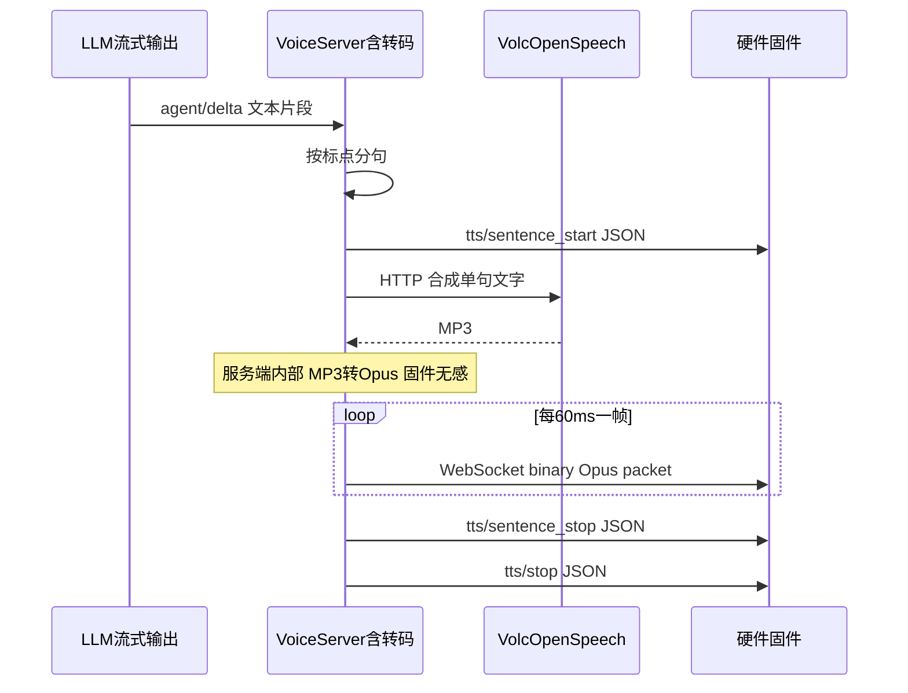

# 硬件 TTS 下行说明（固件工程师）

> 本文只讲 **文字怎么变成你扬声器里的声音**（下行 TTS）。鉴权、上行 STT、完整一轮对话见 [VOICE_HARDWARE_WS_PROTOCOL.md](VOICE_HARDWARE_WS_PROTOCOL.md)、[VOICE_HARDWARE_INTEGRATION.md](VOICE_HARDWARE_INTEGRATION.md)。

## 一句话

**硬件只收 Opus 小包；火山合成、MP3 转 Opus 全在舒心云端完成。固件不需要 ffmpeg，也不需要火山 API Key。**

---

## 固件不需要装什么

| 不需要 | 原因 |
|--------|------|
| **ffmpeg** | MP3 转 Opus 在 **舒心 Docker 服务端** 内完成，与 ESP32 无关 |
| **火山 / 豆包 API Key** | 服务端代调，固件只连 WebSocket |
| **MP3 解码器（下行）** | 下行永远是 **裸 Opus packet**，不是 MP3、不是 Ogg 文件 |
| **直连互联网语音云** | 所有合成经 `ws://<host>:8765/ws/voice` |

固件需要：**WebSocket 客户端** + **Opus 解码**（24 kHz、单声道、60 ms 一帧，与 `hello` 里协商的 `downlink_sample_rate` / `frame_duration` 一致）。

---

## 你会收到什么

### 1. JSON 控制事件（按顺序）

整轮回复可能有多句，每句各有一段二进制音频夹在中间：

```text
tts/start
  → tts/sentence_start（第 1 句）
  → [多条 WebSocket 二进制：Opus 包]
  → tts/sentence_stop（第 1 句）
  → tts/sentence_start（第 2 句，若有）
  → ...
tts/stop
```

示例（与协议文档一致）：

```json
{"type":"tts","state":"start"}
```

```json
{"type":"tts","state":"sentence_start","text":"你好，","index":1,"total_elapsed_ms":2500}
```

```json
{"type":"tts","state":"sentence_stop","text":"你好，","index":1,"elapsed_ms":900,"total_elapsed_ms":3400}
```

```json
{"type":"tts","state":"stop","elapsed_ms":800,"total_elapsed_ms":3600,"first_agent_delta_ms":1200,"first_tts_audio_ms":2500,"llm_ttft_ms":1200,"error_kind":""}
```

**固件播放建议**：在 `sentence_start` 与 `sentence_stop` 之间，按到达顺序解码并播放 Opus 包；收到 `sentence_stop` 可 flush 本句缓冲。

### 3. 动作文本与纯动作分句说明 (重要)
为了支持硬件端根据文本中的动作（即括号包围的内容，如 `（耳朵微微竖起，尾巴轻轻摆动）`）触发对应的实体舵机或屏显动作，下行逻辑采用了如下设计：
1. **TTS 合成文本过滤**：发送给 TTS 进行语音合成时，括号内的动作文字会被过滤掉（不读出括号内的汉字），保证语音交互自然。
2. **事件参数 text 保持原始**：`tts/sentence_start` 和 `tts/sentence_stop` 里的 `text` 字段仍然会**保持包含动作括号的完整原始文本**。固件端应当解析此 `text` 字段中的括号内容来驱动神态动作。
3. **纯动作分句跳过音频下发**：当分句纯粹由动作括号组成、无任何台词时（例如整个分句是 `（耳朵微微竖起）`），服务端**依旧会发送 `sentence_start` 和 `sentence_stop` 状态事件**，但**不发送任何 Opus 二进制包**。固件收到此事件时应直接触发物理动作，而不应因为在此时间段内没收到音频包而判断为超时或异常。

### 2. 二进制音频（Opus）

- **时机**：仅在 `tts/sentence_start` 与 `tts/sentence_stop` **之间**。
- **格式**：**裸 Opus packet**（raw packet），**不是** Ogg 容器，**不是** MP3。
- **一条 WebSocket binary 消息 = 一个 Opus packet**（典型几百字节，一般不超过 4 KB）。
- **参数**（`hello` 成功时服务端会回传）：
  - `downlink_sample_rate`: **24000** Hz
  - `channels`: **1**
  - `frame_duration`: **60** ms（每包约 60 ms 音频）

---

## 服务端内部在干什么（固件可跳过）

文字不是设备合成的，流程在云端：



| 步骤 | 谁做 | 说明 |
|------|------|------|
| 1. 分句 | 舒心服务端 | LLM 边出字边按句号等切成短句，不必等整段说完 |
| 2. 合成 | 火山引擎 **OpenSpeech 语音复刻** | HTTP API，返回 **MP3**（团队口语有时叫「豆包 TTS」，指同一套字节语音能力，**不是**豆包大模型对话 API） |
| 3. 转 Opus | 舒心 **Docker 容器内** | MP3 → PCM 24 kHz → Opus 60 ms 帧；用容器自带工具，**固件不参与** |
| 4. 下发 | WebSocket | 每个 Opus 帧单独一条 binary 消息 |

**重要**：火山是 **整句合成完** 再开始切 Opus 推送，不是 token 级边合成边推 Opus。首包延迟 ≈ 该句火山耗时 + 转码时间。

---

## 和浏览器测试台的区别

| | 硬件（ESP32） | 浏览器 `/voice-demo` |
|--|----------------|----------------------|
| `client_id` | 非 `web-demo` | `web-demo` |
| 下行音频 | **Opus 多包** | 整段 **MP3** 单包 |
| 是否要 Opus 解码 | **要** | 否（浏览器播 MP3） |

不要用 Web 测试台的 MP3 行为去推断硬件协议。

---

## 固件实现要点

1. **hello** 使用 `device_code` + `device_secret`，并声明 `audio_params.format=opus`（见 [QUICKSTART §3](VOICE_HARDWARE_QUICKSTART.md)）。
2. 下行 binary 只在 `sentence_start`～`sentence_stop` 之间处理；其它时刻收到的 binary 应忽略或打日志。
3. Opus 解码参数与 `hello` 响应里的 `audio_params` 一致（下行 **24 kHz**）。
4. 单包大小：典型 1–2 KB，硬上限 **4096 B**；按包顺序解码即可，无需自己再切 MP3。
5. **不要**在设备上安装或依赖 ffmpeg。

---

## 排错速查

| 现象 | 固件侧查 | 服务端侧（找后端） |
|------|----------|-------------------|
| 有 `sentence_start` 无声音 | Opus 解码采样率是否 24 kHz；是否在等 MP3 | 火山 Key、音色、`VOLCENGINE_TTS_*` |
| 完全没有 `tts/start` | 是否已收到 `agent/delta` / `agent/reply` | LLM 是否空回复、`error_kind` |
| `hello` 报 opus | — | Docker 缺 `opuslib_next`，需 redeploy |
| 误装 ffmpeg | **不需要**，删掉相关依赖即可 | — |

---

## 相关文档

- [VOICE_HARDWARE_WS_PROTOCOL.md](VOICE_HARDWARE_WS_PROTOCOL.md) — 完整 WebSocket 字段
- [VOICE_HARDWARE_INTEGRATION.md](VOICE_HARDWARE_INTEGRATION.md) — 鉴权与云能力边界
- [VOICE_HARDWARE_QUICKSTART.md](VOICE_HARDWARE_QUICKSTART.md) — 1 页联调清单
