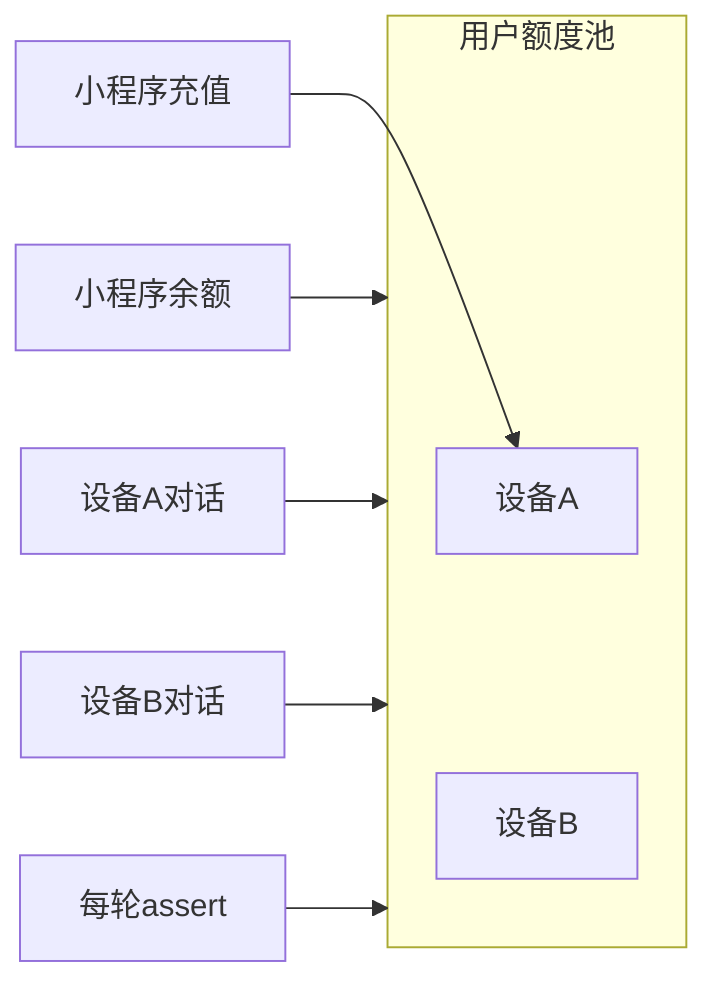

# 语音额度门控 — 测试总结

> **用途**：额度用尽拦截、用户级共用池、Docker 内验收的**唯一测试入口**。  
> **版本**：2026-07 · 本地 Docker + 生产部署后回归均可复用。

---

## 1. 功能摘要

### 1.1 预期行为

- 用户**额度池耗尽**后，**下一次**发起对话应被拦截，**不**进入 STT / LLM / TTS。
- WebSocket **保持连接**；用户充值后可同连接重试。
- 服务端下发 JSON 错误；**硬件**收到后播放本地预置音（`QUOTA_EXHAUSTED`），服务端**不**播 TTS。

### 1.2 实现位置

| 环节 | 文件 / 函数 |
|------|-------------|
| 每轮门控 | [`src/shuxin/voice/server.py`](../src/shuxin/voice/server.py) `_assert_quota_for_turn()` |
| 调用点 | `_process_turn`、`_process_text_turn`（STT **之前**） |
| 额度查询 | [`src/shuxin/voice/postgres_repository.py`](../src/shuxin/voice/postgres_repository.py) `get_device_quota()` |
| 断言 | `assert_device_quota_available(device_id)` |
| 扣费 | `deduct_device_minutes_quota(device_id, cost_minutes)`（turn 结束后异步） |
| 协议 | [`docs/VOICE_HARDWARE_WS_PROTOCOL.md`](VOICE_HARDWARE_WS_PROTOCOL.md) § `quota_exhausted` |

### 1.3 成功响应示例

`listen/stop` 或 `text_turn` 路径（推荐硬件依赖此格式）：

```json
{"type":"error","error_kind":"quota_exhausted","message":"额度已用尽，请充值"}
```

硬件：解析 `error_kind == "quota_exhausted"` → 播放本地资源键 `QUOTA_EXHAUSTED`（文案「额度已用尽，请充值」）。

### 1.4 额度模型（用户级共用池）

同一微信用户名下 **所有 `active` 绑定设备** 共用一套分钟额度：

```
充值入账 → 写入某一 devices 行（订单 device_id 或最近绑定设备）
小程序展示 → 汇总该用户所有设备的 订阅剩余 + 加油包 + 每日低保
任意设备对话 → 从同一用户池扣费
每轮门控   → get_device_quota(当前 device_id) 内部仍做用户级汇总
```



**扣费优先级**（单用户多设备时按池子统一扣）：订阅分钟 → 加油包 → 每日低保。

**跨月**：仅重置 `subscription_minutes_used`；`fuel_minutes_balance`（加油包）**永久保留**。

---

## 2. 诊断案例（2026-07，避免重复踩坑）

用户 `test` 在 voice-demo 使用 `SX-000134`，仅 SQL 清零该设备后仍能对话。

| 项目 | 实测结果 |
|------|----------|
| 只清零的设备 | `SX-000134`（fuel=0） |
| 同用户另一台设备 | `SX-000064`：订阅约 300 分钟，有效期至 2026-09-30 |
| Admin API 清零前 | `remain_yuan: 304.36`，`exhausted: false` |
| 对**该用户所有绑定设备**清零后 | `exhausted: true`，`remain_yuan: 0` |
| WebSocket 实测 | `{"type":"error","message":"额度已用尽，请充值"}`，无 `stt/final` / `agent/reply` |

**结论**：门控逻辑正常；只清一台设备 ≠ 全池耗尽。

---

## 3. Docker 前置

| 项 | 值 |
|----|-----|
| Postgres 容器 | `shuxin-postgres` |
| Voice 容器 | `shuxin-voice-demo-pg` |
| 端口 | `8765`（`VOICE_DEMO_PORT`） |
| Admin Token | `.env` 中 `SHUXIN_ADMIN_TOKEN`，本地默认 `dev-admin-token` |
| 本地代码挂载 | `docker-compose.yml` 挂载 `./src`、`./tests` |

```bash
cd /path/to/shuxin

# 确认 Docker
docker info 2>&1 | grep -E "Server Version|Cannot connect"

# 代码变更后重启（本地一般不需 rebuild）
bash scripts/redeploy_docker.sh --skip-build

# 健康检查
curl -s http://localhost:8765/health
```

生产（`docker-compose.prod.yml`，无 src 挂载）须 **带 build** 重部署：

```bash
COMPOSE_FILE=docker-compose.yml:docker-compose.prod.yml bash scripts/redeploy_docker.sh
```

确认门控代码已加载：

```bash
docker exec shuxin-voice-demo-pg grep -n "_assert_quota_for_turn" /app/src/shuxin/voice/server.py
# 应看到 1742、1975（调用）与 2082（定义）附近
```

---

## 4. 验收步骤（复制即用）

将 `<USER_ID>`、`<DEVICE_ID>` 替换为实际值（示例：`test` / `SX-000134`）。

### Step 1 — 查用户绑定了哪些设备

```bash
docker exec shuxin-postgres psql -U shuxin -d shuxin -c \
  "SELECT b.user_id, b.device_id, b.status
   FROM device_bindings b
   WHERE b.user_id = '<USER_ID>' AND b.status = 'active';"
```

### Step 2 — 各设备额度明细

```bash
docker exec shuxin-postgres psql -U shuxin -d shuxin -c \
  "SELECT d.device_id,
          d.fuel_minutes_balance,
          d.subscription_minutes_limit,
          d.subscription_minutes_used,
          d.subscription_expires_at,
          d.daily_allowance_seconds_used,
          d.daily_allowance_date
   FROM devices d
   JOIN device_bindings b ON b.device_id = d.device_id AND b.status = 'active'
   WHERE b.user_id = '<USER_ID>';"
```

### Step 3 — Admin API 查看服务端汇总额度

```bash
curl -s -H "X-Admin-Token: dev-admin-token" \
  "http://localhost:8765/admin/api/users/<USER_ID>/quota" | python3 -m json.tool
```

**应拦截时关注**：

| 字段 | 期望 |
|------|------|
| `remain_yuan` / `total_minutes_left` | `0` |
| `exhausted` | `true` |
| `subscription_minutes_left` + `fuel_minutes_left` + `daily_allowance_left` | 合计 `0` |

若 `exhausted: false` 且 `remain_yuan > 0`，说明**用户池仍有分钟**（常见：只清了一台设备）。

### Step 4 — 清零「整个用户池」（非单设备）

```bash
docker exec shuxin-postgres psql -U shuxin -d shuxin -c "
UPDATE devices d
SET subscription_minutes_limit = 0,
    subscription_minutes_used = 0,
    subscription_expires_at = NULL,
    fuel_minutes_balance = 0,
    daily_allowance_seconds_used = 99999,
    daily_allowance_date = CURRENT_DATE
FROM device_bindings b
WHERE b.device_id = d.device_id
  AND b.user_id = '<USER_ID>'
  AND b.status = 'active';
"
```

再次执行 Step 3，确认 `exhausted: true`。

### Step 5 — voice-demo 浏览器验收

1. 打开 http://localhost:8765/voice-demo  
2. Admin 登录后选择目标用户 / 设备（或手动填 `device_code` + `device_secret`）  
3. **断开再连接**（确保新会话）  
4. 录音一轮  

**预期日志**：

- 出现 `error` 且含「额度已用尽」或 `error_kind: quota_exhausted`
- **不出现** `stt/final`、`agent/reply`、`tts/sentence_*`

页面 boundUser 行应显示 `<USER_ID> / <DEVICE_ID>`。

### Step 6 — 容器内 WebSocket 冒烟（可选）

取设备密钥：

```bash
curl -s -H "X-Admin-Token: dev-admin-token" \
  "http://localhost:8765/admin/api/voice-demo/targets" | python3 -m json.tool
```

从返回的 `items` 中找到 `<DEVICE_ID>` 的 `device_secret`，执行：

```bash
docker exec shuxin-voice-demo-pg python /app/scripts/ws_opus_smoke_test.py \
  --url ws://127.0.0.1:8765/ws/voice \
  --device-code <DEVICE_ID> \
  --device-secret '<DEVICE_SECRET>' \
  --input /app/data/device_assets/zh-CN/ACTIVATION.ogg \
  --output /app/outputs/quota-gate-test.wav \
  --timeout 30
```

额度耗尽时可能在 `listen start` 阶段即返回错误（见 §6 已知差异）。

### Step 7 — 单元测试（pytest）

```bash
docker exec shuxin-voice-demo-pg pip install -q pytest   # 镜像未含时执行一次

docker exec -w /app shuxin-voice-demo-pg env PYTHONPATH=src \
  python -m pytest tests/test_voice_quota_gate.py -q

docker exec -w /app shuxin-voice-demo-pg env PYTHONPATH=src \
  python -m pytest \
  tests/test_miniapp_billing.py::test_cross_month_reset_preserves_fuel_balance_on_query \
  tests/test_miniapp_billing.py::test_cross_month_reset_preserves_fuel_balance_on_deduct \
  -q
```

---

## 5. 首绑礼包验收

绑定**不受**额度门控；礼包按**设备**终身一次（`metadata.activation_gift_applied` + 无历史 binding）。小程序展示的 `remain_yuan` / `total_minutes_left` 为**语音分钟池**，与 DMX 余额无关。

### 单元测试（不依赖 Docker）

```bash
PYTHONPATH=src pytest tests/test_activation_gift_flow.py tests/test_miniapp_billing.py -q
```

覆盖：`admin_bind` 首绑 → 额度 ≥120 → 全池清零 `exhausted` → 小程序 `POST /api/devices/bind` 新机恢复额度 → 重绑不重复礼包。

### Docker 一键冒烟

```bash
# 需 compose 已 up（voice + postgres）
bash scripts/smoke_activation_gift.sh
```

脚本行为：创建 `wx_smoke_*` 临时用户 → Admin 绑设备 A → 断言 120 分钟 → 清零用户池 → 注入 session 绑设备 B（200 + 额度恢复）→ 解绑/重绑 A 不重复礼包 → 退出时清理 active 绑定。退出码 `0` 为通过。

可选环境变量：`SHUXIN_ADMIN_TOKEN`、`VOICE_BASE`、`SMOKE_DEVICE_A`、`SMOKE_DEVICE_B`。

自动选设备时要求：`provisioned` 且**从未**出现在 `device_bindings`（有历史记录的解绑机不会再发礼包）。

---

## 6. 常见踩坑

| 现象 | 原因 | 处理 |
|------|------|------|
| 只清 `SX-000134` 仍能对话 | 同用户还有其它设备有余额（如 `SX-000064` 订阅 300 分钟） | Step 1–2 查全部 binding；Step 4 全用户清零 |
| 小程序显示 0 分钟但还能聊 | 其它设备或每日低保仍计入池子；或测试时未全池清零 | 用 Admin `/quota` API 看汇总，不要只看单设备 SQL |
| redeploy 后旧行为 | 生产未 rebuild；或浏览器 WS 未重连 | prod 须 build；voice-demo 断开重连 |
| `listen` 报错无 `error_kind` | `listen start` → `_start_realtime_asr_if_needed` 失败时仅发 `message`（见 §6） | 硬件可同时匹配 `message` 含「额度已用尽」；或 follow-up 统一 `error_kind` |
| 跨月后加油包消失 | 旧 bug：跨月误清 `fuel_minutes_balance` | 已修复；跑 §4 Step 7 跨月用例 |
| 扣费落在错误设备 | `_process_turn` 未传 `device_id` 给 billing | 已修复；`record_usage_in_background(..., device_id=...)` |

---

## 7. 已知差异（follow-up）

`listen start` 路径在 `_start_realtime_asr_if_needed()` 内若因额度失败，当前返回：

```json
{"type":"error","message":"额度已用尽，请充值"}
```

**无** `error_kind: quota_exhausted`。`listen/stop` → `_process_turn` 路径会带 `error_kind`。

若固件**仅**识别 `error_kind`，需后续小改对齐；临时可兼判 `message` 含「额度已用尽」。

---

## 8. 恢复测试数据

测试完成后勿长期留全零额度。任选其一：

**Admin**：`/admin` → 用户 → 充值 / 调整额度。

**SQL 模板**（按实际订阅档位修改数值）：

```sql
UPDATE devices
SET subscription_plan_id = 'gaojiban',
    subscription_minutes_limit = 300,
    subscription_minutes_used = 0,
    subscription_expires_at = now() + interval '90 days',
    fuel_minutes_balance = 10,
    daily_allowance_seconds_used = 0,
    daily_allowance_date = NULL
WHERE device_id = '<DEVICE_ID>';
```

---

## 9. 相关文档

| 文档 | 内容 |
|------|------|
| [`VOICE_HARDWARE_WS_PROTOCOL.md`](VOICE_HARDWARE_WS_PROTOCOL.md) | `quota_exhausted` 协议与硬件本地音 |
| [`VOICE_DOCKER_WORKFLOW.md`](VOICE_DOCKER_WORKFLOW.md) | Docker 日常命令 |
| [`VOICE_DEMO_MIN_TEST.md`](VOICE_DEMO_MIN_TEST.md) §9 | voice-demo WebSocket 测试台 |
| [`VOICE_DEMO_MIN_TEST.md`](VOICE_DEMO_MIN_TEST.md) §17 | Opus WS 冒烟脚本 |
| [`PRICING_STRATEGY.md`](PRICING_STRATEGY.md) | 订阅 / 加油包 / 低保产品定义 |
| [`tests/test_voice_quota_gate.py`](../tests/test_voice_quota_gate.py) | 门控单元测试 |
| [`tests/test_activation_gift_flow.py`](../tests/test_activation_gift_flow.py) | 首绑礼包 + 耗尽绑机全链路 |
| [`scripts/smoke_activation_gift.sh`](../scripts/smoke_activation_gift.sh) | Docker 首绑礼包冒烟 |
| [`tests/test_miniapp_billing.py`](../tests/test_miniapp_billing.py) | 扣费与跨月 fuel 测试 |

---

## 10. 快速检查清单

- [ ] `device_bindings`：该用户有几台 `active` 设备？
- [ ] Admin `/admin/api/users/<id>/quota`：`exhausted` 是否为 `true`？
- [ ] voice-demo / WS：额度耗尽后无 STT/LLM/TTS？
- [ ] `bash scripts/smoke_activation_gift.sh` 通过？（首绑礼包）
- [ ] 硬件：`quota_exhausted` 或额度文案 → 本地 `QUOTA_EXHAUSTED` 提示音？
