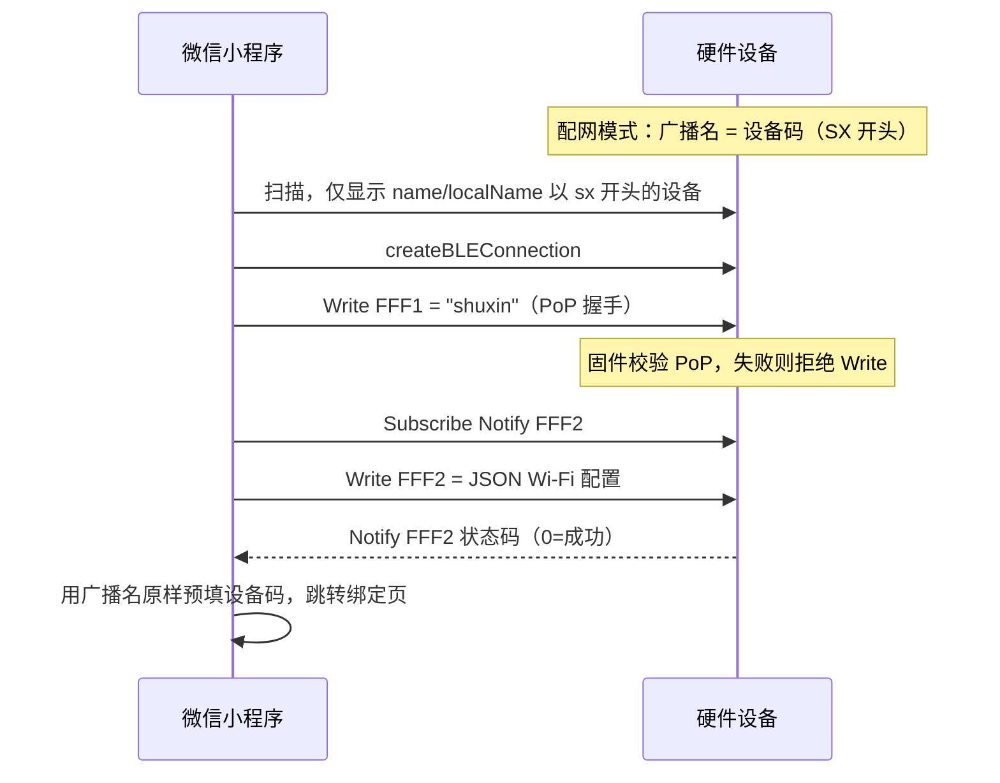

# 微信小程序蓝牙配网 — 硬件对接说明

**版本**：2026-07-06  
**受众**：固件 / 硬件工程师  
**小程序实现**：[`apps/wechat-miniprogram/src/pages/prov/ble.vue`](../apps/wechat-miniprogram/src/pages/prov/ble.vue)  
**过滤逻辑**：[`apps/wechat-miniprogram/src/utils/ble-discovery.ts`](../apps/wechat-miniprogram/src/utils/ble-discovery.ts)

---

## 1. 整体流程

```text
用户打开配网页 → 扫描 BLE → 选择设备 → 建立连接 → PoP 握手 → 下发 Wi-Fi → 设备联网 → 返回绑定页
```



**说明**：蓝牙配网 ≠ 账号绑定。配网只负责让设备连上 Wi-Fi；绑定由用户在小程序绑定页提交 `device_code` / `claim_code` 完成。

---

## 2. 配网模式 — BLE 广播要求

| 项 | 要求 |
|----|------|
| 模式入口 | 用户长按 / 未联网首次开机等，进入配网模式（指示灯快闪） |
| 广播名 | **必须**设置 `name` 或 `localName`（二者至少一个有值） |
| 名称内容 | **等于系统分配的设备码**，且以 `SX` 开头（大小写不限） |
| 示例 | `SX-000131`、`sx-000131` |
| 错误示例 | 无广播名、仅 MAC、`iph-xxx`、`shuxin`（不以 sx 开头） |

小程序过滤规则：`name.toLowerCase().startsWith("sx")`。不满足的设备**不会出现在列表**。

配网成功后，小程序把**完整广播名**写入本地缓存，绑定页**原样预填**，不做 `SX-` / `ShuXin-` 等格式转换。

---

## 3. GATT 服务与特征值

| 角色 | UUID | 说明 |
|------|------|------|
| 配网服务 | `0000FFFF-0000-1000-8000-00805F9B34FB` | 配网专用 Service |
| 会话 / PoP | `0000FFF1-0000-1000-8000-00805F9B34FB` | Write：接收 PoP 密钥 |
| 配置 / 状态 | `0000FFF2-0000-1000-8000-00805F9B34FB` | Write：Wi-Fi JSON；Notify：状态码 |

固件须在配网模式下暴露上述 Service 及两个 Characteristic。

---

## 4. PoP 安全握手（双方必须实现）

**目的**：防止误连附近其他 BLE 设备。

| 方向 | 内容 |
|------|------|
| 发起方 | 微信小程序（连接成功后） |
| 目标特征值 | `0000FFF1` |
| 写入内容 | ASCII 字符串 **`shuxin`**（6 字节，无结尾 `\0`） |
| 小程序判定 | `writeBLECharacteristicValue` 返回 **success** → 进入填 Wi-Fi 页 |
| 小程序判定 | **fail** → 提示「可能不是初心设备」，断开连接 |

### 固件必须实现

1. 监听 `FFF1` 的 **Write** 请求。
2. 读出 payload，与固件内预设值 **`shuxin`** 逐字节比对。
3. **匹配**：置位「配网会话已授权」，允许后续 `FFF2` 接收 Wi-Fi 配置。
4. **不匹配**：返回 GATT 错误 / 拒绝写入，**不得**进入配网数据接收。

> 若固件对任意写入都返回成功，PoP 无实际保护作用。  
> 当前小程序**不**读取 Notify 回包确认握手，仅以 Write 是否被硬件接受为准。若需双向确认，请与小程序同事协商扩展协议。

---

## 5. Wi-Fi 配置下发

**前置条件**：PoP 握手已通过。

### 5.1 订阅状态（小程序 → 硬件）

- 对 `0000FFF2` 开启 **Notify**（`notifyBLECharacteristicValueChange`）。

### 5.2 写入配置（小程序 → 硬件）

- 目标特征值：`0000FFF2`
- 格式：**UTF-8 JSON 字符串**（非二进制 Protobuf）

```json
{"ssid":"你的WiFi名称","password":"你的WiFi密码"}
```

- `password` 可为空字符串（开放网络）。
- 建议硬件仅支持 **2.4GHz** Wi-Fi；5GHz 需在配网说明中提示用户。

### 5.3 状态通知（硬件 → 小程序）

硬件通过 `FFF2` **Notify** 发送 **1 字节**状态码：

| 状态码 | 含义 | 小程序表现 |
|--------|------|------------|
| `0` | 联网成功，已获取 IP | 配网成功，2s 后回绑定页并预填设备码 |
| `1` | 正在连接路由器 | 日志提示「正在关联 Wi-Fi」 |
| `2` | Wi-Fi 密码错误 | 失败：密码错误 |
| `3` | 找不到 AP（SSID） | 失败：找不到 Wi-Fi |
| `4` | DHCP 失败 | 失败：IP 获取超时 |
| `5` 或其他 | 未知错误 | 失败：网络异常 |

- 配网超时：**60 秒**内未收到 `0` 则小程序提示超时。
- 收到 `0` 后建议硬件可退出配网广播或关闭 BLE 配网服务以省电。

---

## 6. 联调检查清单

### 硬件侧

- [ ] 配网模式广播名 = 设备码，且以 `SX` 开头（如 `SX-000131`）
- [ ] `name` / `localName` 非空
- [ ] Service `FFFF`、特征值 `FFF1` / `FFF2` 可发现
- [ ] `FFF1` 仅在接受 `shuxin` 后允许配网
- [ ] `FFF2` Write 可解析 JSON `ssid` / `password`
- [ ] `FFF2` Notify 按上表回传 1 字节状态码

### 联调步骤

1. 硬件进入配网模式，确认手机蓝牙助手能看到 `SX-xxx` 名称。
2. 小程序：绑定页 →「新设备未联网？立即进行蓝牙配网」→ 开始扫描。
3. 列表应出现该设备 → 连接 → 自动 PoP → 进入 Wi-Fi 页。
4. 填写 2.4GHz Wi-Fi → 发送 → 观察 Notify 状态码直至 `0`。
5. 自动回绑定页，设备码应已预填为广播名（如 `SX-000131`）。

### 常见问题

| 现象 | 可能原因 |
|------|----------|
| 扫描列表为空 | 未广播名称；名称不以 `sx` 开头；未进配网模式 |
| 连接后提示「安全通道握手失败」 | `FFF1` 未实现或 PoP 值不是 `shuxin` |
| 写入 Wi-Fi 失败 | PoP 未通过；`FFF2` 未开放 Write |
| 一直不成功 | 用了 5GHz Wi-Fi；密码错误；未发 Notify |

---

## 7. 与小程序同事的接口变更记录

| 日期 | 变更 |
|------|------|
| 2026-07-06 | 扫描前缀由测试用 `iph` 改为 **`SX`（大小写不敏感）** |
| 2026-07-06 | 设备码预填：广播名**原样**使用，不再做格式转换 |

PoP 密钥 **`shuxin`**、Service/Characteristic UUID、Wi-Fi JSON 格式、状态码表**未变**。

---

## 8. 参考文档

- 小程序合规与验收：[`docs/WECHAT_MINIPROGRAM.md`](WECHAT_MINIPROGRAM.md)
- 小程序开发编译：[`apps/wechat-miniprogram/README.md`](../apps/wechat-miniprogram/README.md)
- 语音硬件总手册（WebSocket 等）：[`docs/VOICE_HARDWARE_HANDBOOK.md`](VOICE_HARDWARE_HANDBOOK.md)
