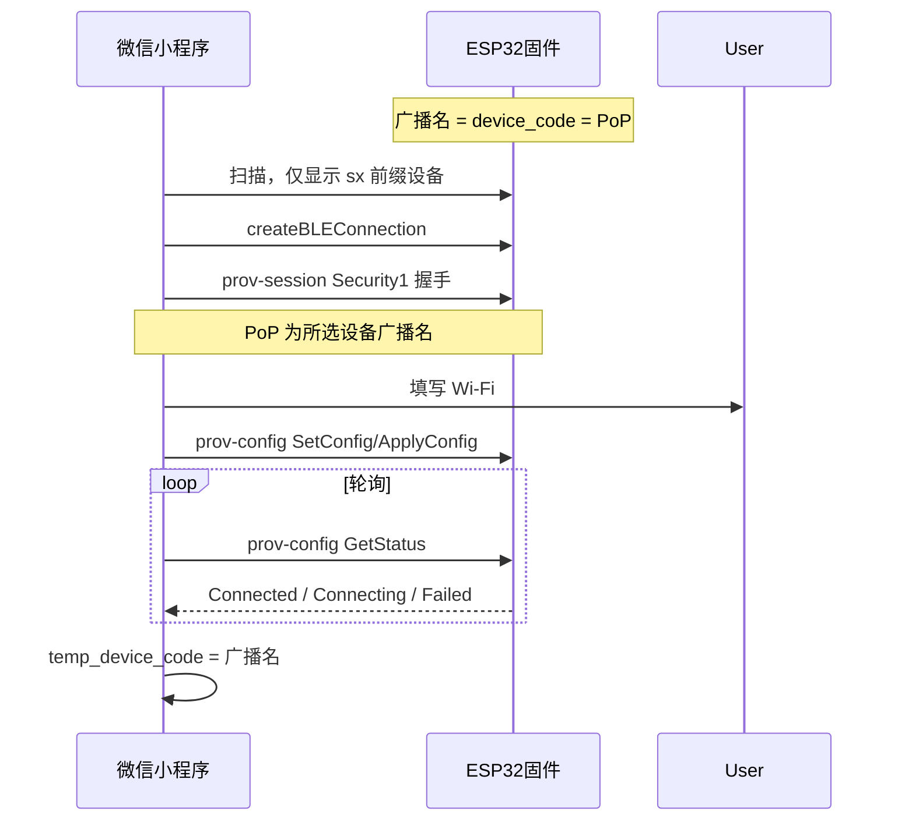

# 微信小程序蓝牙配网 — 硬件对接说明（ESP-IDF 标准协议）

**版本**：2026-07-06  
**受众**：固件 / 硬件工程师  
**小程序实现**：[`apps/wechat-miniprogram/src/pages/prov/ble.vue`](../apps/wechat-miniprogram/src/pages/prov/ble.vue)  
**协议客户端**：[`apps/wechat-miniprogram/src/pages/prov/esp-idf-prov/`](../apps/wechat-miniprogram/src/pages/prov/esp-idf-prov/)  
**扫描过滤**：[`apps/wechat-miniprogram/src/utils/ble-discovery.ts`](../apps/wechat-miniprogram/src/utils/ble-discovery.ts)

---

## 1. 协议说明

小程序已适配 **ESP-IDF 标准 BLE 配网**（`wifi_prov_mgr` + `wifi_prov_scheme_ble` + `WIFI_PROV_SECURITY_1`），**不再**使用已废弃的自定义 `FFFF/FFF1/FFF2 + JSON` 方案。

| 层级 | 技术 |
|------|------|
| 传输 | BLE GATT + protocomm |
| 安全 | Security1：X25519 密钥交换 + PoP + AES-CTR |
| 配网数据 | Protobuf（`prov-session` / `prov-config`） |
| Wi-Fi 流程 | SetConfig → ApplyConfig → GetStatus 轮询 |

---

## 2. 整体流程

```text
扫描 SX 设备 → 用户点击 SX-000003 → BLE 连接
→ Security1 握手（PoP = SX-000003）→ 用户填 Wi-Fi
→ 加密下发 SSID/密码 → 设备联网 → 绑定页预填 SX-000003
```



蓝牙配网 ≠ 账号绑定。配网只负责 Wi-Fi；绑定由用户在绑定页提交 `device_code` / `claim_code` 完成。

---

## 3. 固件必须满足的三件事

### 3.1 BLE 广播名 = 设备码

| 项 | 要求 |
|----|------|
| 字段 | `name` 或 `localName` 至少一个有值 |
| 内容 | **等于** `SHUXIN_DEVICE_CODE`（系统分配） |
| 格式 | 以 `SX` 开头（大小写不限），如 `SX-000003` |
| 禁止 | 无广播名、仅 MAC、`PROV_` 前缀代替设备码 |

小程序过滤：`name.toLowerCase().startsWith("sx")`。

### 3.2 PoP（当前量产固件）

| 项 | 要求 |
|----|------|
| 安全方案 | `WIFI_PROV_SECURITY_1` |
| **当前固件 PoP** | 固定字符串 **`shuxin`**（见 `ble_wifi_provisioner.cc` 中 `kProofOfPossession`） |
| BLE 广播名 | 仍为 `device_code`（如 `SX-000003`），用于扫描识别与绑定预填 |

小程序点击设备后使用 **PoP=`shuxin`** 参与 Security1 握手；**广播名仅用于列表展示与配网成功后绑定页预填**，不作为 PoP。

> 若未来固件改为 `PoP == device_code`，须同步修改小程序 [`constants.ts`](../apps/wechat-miniprogram/src/pages/prov/esp-idf-prov/constants.ts) 中 `PROVISION_POP` 的取值逻辑。

### 3.3 保留 ESP-IDF 标准配网栈

- `wifi_prov_mgr`
- `wifi_prov_scheme_ble`
- Wi-Fi 凭据校验、保存、超时与 BLE 资源释放逻辑**无需为小程序重写**

仅需在业务层把广播名与 PoP 设为 `SHUXIN_DEVICE_CODE`，并更新屏幕/语音提示（勿再引导用户搜索 `PROV_` 设备）。

---

## 4. GATT 与 protocomm 端点

默认 Service UUID（**ESP-IDF v5.x** `wifi_prov_scheme_ble` 内置值，与量产固件一致）：

```text
1775244D-6B43-439B-877C-060F2D9BED07
```

旧版 ESP-IDF v4 文档中的 `0000FFFF-0000-1000-8000-00805F9B34FB` 仅适用于显式 `wifi_prov_scheme_ble_set_service_uuid(FFFF)` 的固件。若固件使用其他自定义 128-bit UUID，须与小程序 [`constants.ts`](../apps/wechat-miniprogram/src/pages/prov/esp-idf-prov/constants.ts) 同步。

| Endpoint 名 | 短 UUID | 用途 |
|-------------|---------|------|
| `prov-session` | `ff51` | Security1 会话握手 |
| `prov-config` | `ff52` | Wi-Fi 配置与状态 |
| `prov-scan` | `ff53` | （可选）扫描 AP |
| `proto-ver` | `ff54` | 协议版本 |

特征值 UUID 推导规则与 ESP-IDF `esp_prov` 工具一致：在 Service UUID 基础上**替换末尾 4 个十六进制字符**（小端 byte[0..1]）：

```
Service UUID:       1775244D-6B43-439B-877C-060F2D9BED07
prov-session(ff51): 1775244D-6B43-439B-877C-060F2D9BFF51
prov-config (ff52): 1775244D-6B43-439B-877C-060F2D9BFF52
```

小程序通过 GATT **User Description** 描述符（`0x2901`）读取 endpoint 名称；读失败时按上表 fallback。

---

## 5. Security1 握手（非明文写 PoP）

**注意**：PoP **不是**向某个特征值直接写入明文字符串。

正确流程（与乐鑫官方 App 一致）：

1. 客户端生成 X25519 密钥对，向 `prov-session` 发送 `SessionCmd0`（含 client_pubkey）
2. 设备返回 `SessionResp0`（device_pubkey + device_random）
3. 双方派生共享密钥：`curve25519` 结果 XOR `SHA256(PoP)`
4. 客户端向 `prov-session` 发送加密的 `SessionCmd1`（client_verify）
5. 设备返回 `SessionResp1`（device_verify），客户端验证后会话建立

PoP 校验失败时，小程序提示「设备 PoP 校验失败，请确认选择了正确的设备」。

---

## 6. Wi-Fi 配置（prov-config）

会话建立后，所有 `prov-config` 数据经 AES-CTR 加密。

| 步骤 | 消息 | 说明 |
|------|------|------|
| 1 | `CmdSetConfig` | 下发 `ssid` + `passphrase`（UTF-8） |
| 2 | `CmdApplyConfig` | 应用配置，设备开始连路由器 |
| 3 | `CmdGetStatus` | 轮询，直至 `Connected` 或失败 |

### Wi-Fi 状态枚举（`WifiStationState`）

| 值 | 含义 | 小程序表现 |
|----|------|------------|
| `0` Connected | 已获取 IP | 配网成功，预填设备码 |
| `1` Connecting | 连接中 | 日志「正在连接 Wi-Fi」 |
| `2` Disconnected | 未连接 | 继续轮询 |
| `3` ConnectionFailed | 失败 | 见下表 |

### 失败原因（`WifiConnectFailedReason`）

| 值 | 含义 | 用户提示 |
|----|------|----------|
| `0` AuthError | 密码错误 | Wi-Fi 密码错误 |
| `1` NetworkNotFound | SSID 不存在 | 找不到指定的 Wi-Fi |

轮询间隔约 2 秒，最长约 60 秒超时。

---

## 7. 联调检查清单

### 固件侧

- [ ] 配网模式广播名 = `SX-xxxxxx`（= device_code）
- [ ] PoP 与固件一致（当前为固定 `shuxin`）
- [ ] `wifi_prov_mgr` + `WIFI_PROV_SECURITY_1` 正常工作
- [ ] 乐鑫 **ESP BLE Provisioning** App 使用 PoP **`shuxin`** 可配网成功
- [ ] 屏幕/语音不再提示搜索 `PROV_` 设备

### 小程序侧

- [ ] 列表仅显示 `SX` 开头设备
- [ ] 点击设备后 Security1 握手成功
- [ ] 正确 Wi-Fi 配网成功，绑定页预填广播名
- [ ] 错误密码有明确提示

### 联调步骤

1. 设备进入配网模式，手机蓝牙助手可见 `SX-000003`
2. 小程序：绑定页 → 蓝牙配网 → 开始扫描 → 点击设备
3. 日志应出现「安全会话建立成功」
4. 填写 2.4GHz Wi-Fi → 等待 Connected
5. 自动回绑定页，设备码已预填

### 常见问题

| 现象 | 可能原因 |
|------|----------|
| 扫描列表为空 | 广播名非 `sx` 前缀或未进配网模式 |
| 未找到 ESP-IDF 配网 BLE 服务 | 小程序仍按旧 `FFFF` 查找；或 GATT 尚未就绪。若日志「已发现」含 `1775244D-...` 须升级小程序 |
| Security1 / PoP 失败 | 小程序误用广播名作 PoP；当前固件 PoP 须为 `shuxin` |
| SetConfig 失败 | 会话未建立；Service UUID 不一致 |
| 一直 Connecting | 信号弱、5GHz SSID、路由器拒绝 |
| 密码错误 | `ConnectionFailed` + `AuthError` |

---

## 8. 与旧版文档的差异

| 项目 | 旧版（已废弃） | 现行 |
|------|----------------|------|
| 握手 | 向 `FFF1` 写明文 `shuxin` | `prov-session` Security1 |
| Wi-Fi | 向 `FFF2` 写 JSON | `prov-config` 加密 Protobuf |
| 状态 | `FFF2` 单字节 Notify | `GetStatus` Protobuf |
| PoP | 固定 `shuxin`（当前固件） | Security1 XOR `SHA256(PoP)` |
| 广播名 | `SX` 前缀 | 不变 |

---

## 9. 参考

- [ESP-IDF Wi-Fi Provisioning](https://docs.espressif.com/projects/esp-idf/en/stable/esp32/api-reference/provisioning/wifi_provisioning.html)
- [ESP-IDF protocomm](https://docs.espressif.com/projects/esp-idf/en/stable/esp32/api-reference/provisioning/protocomm.html)
- 小程序合规与验收：[`docs/WECHAT_MINIPROGRAM.md`](WECHAT_MINIPROGRAM.md)
